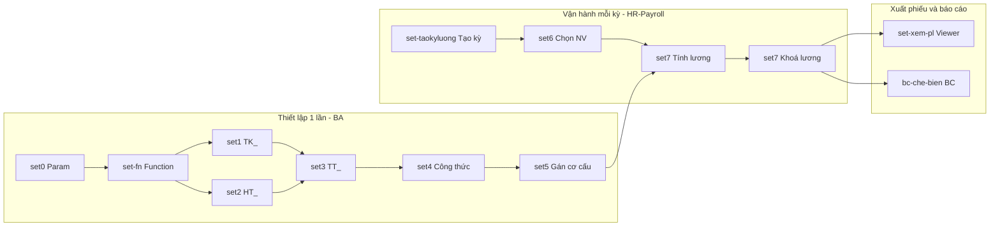

# 01 — Ngữ cảnh & Actors (LTG)

## 1. Ngữ cảnh nghiệp vụ MPHG

### 1.1 Doanh nghiệp

- **Chủ thể**: Công ty Thủy sản Minh Phú - Hậu Giang (MPHG), thành viên Tập đoàn Minh Phú — doanh nghiệp chế biến & xuất khẩu tôm hàng đầu Việt Nam.
- **Quy mô nhân sự**: ~5,000 nhân viên (số liệu 2026), chia thành các nhóm:
  - **BPTL Chế biến**: `CB101` — `CBxxx` (dây chuyền chế biến tôm — Cắt/Phân cỡ/Lột PTO/Xếp khay/Cấp đông/Đóng gói...).
  - **BPTL Vệ sinh**: đội vệ sinh nhà xưởng, xưởng máy — hưởng lương bình quân của BP chế biến (BQTL_VS).
  - **BPTL Văn phòng**: khối gián tiếp — hành chính, nhân sự, kế toán, IT ... hưởng lương thời gian thuần.
- **Đặc thù**: 1 NV có thể **luân chuyển giữa nhiều BPTL/bàn/ka trong 1 tháng** (chuyển dây chuyền do điều động sản xuất) → sinh **nhiều dòng lương/1 kỳ**.

### 1.2 Kỳ lương & mô hình lương

- **Kỳ lương**: theo tháng, chốt cuối tháng (từ ngày 1 → ngày cuối tháng dương lịch). Kỳ có thể có Kỳ 13 (thưởng tết) và Kỳ điều chỉnh (retro).
- **Mô hình lương phức hợp** — 1 NV có thể nhận đồng thời 3 loại lương:
  1. **LTG — Lương Thời Gian**: `Công thực tế × Đơn giá giờ/ngày + phụ cấp`. Áp dụng: khối văn phòng, học việc, gián tiếp.
  2. **LSP — Lương Sản Phẩm**: `Σ(Sản lượng × Đơn giá công đoạn) × Hệ số điều chỉnh (4 lần)`. Áp dụng: chế biến trực tiếp.
  3. **LNS — Lương Năng Suất**: `NS chung theo BP + NS riêng NV` (bonus vượt định mức). Áp dụng: các công đoạn có định mức.
- Module này (**LTG**) là **base**: mọi NV đều có LTG; LSP & LNS chỉ áp dụng cho một số nhóm.

### 1.3 Cơ sở pháp lý & kỹ thuật

| Nguồn | Nội dung |
|-------|----------|
| **Nghị định 145/2020/NĐ-CP · Điều 22** | Quy định phiếu lương phải có đầy đủ khoản thu nhập, khấu trừ, thuế TNCN, BH — mỗi NV mỗi kỳ phải nhận phiếu lương chi tiết. Với NV có N dòng lương → **mỗi dòng = 1 phiếu hợp lệ pháp lý**. |
| **Luật BHXH 2014 + sửa đổi 2024** | BHXH 8% + BHYT 1.5% + BHTN 1% (NV trả). Trần đóng BH = 20 × lương tối thiểu vùng. |
| **Luật Thuế TNCN 2007 + sửa đổi 2012, 2020** | Bậc thuế lũy tiến 7 bậc, giảm trừ gia cảnh 11tr/tháng bản thân + 4.4tr/tháng/người phụ thuộc. |

### 1.4 Kiến trúc hệ thống (context)

```
┌─────────────────────────────────────────────────────────────┐
│              Core cũ MILLENNIUM (do FPT triển khai)         │
│                                                              │
│  ┌────────┐ ┌──────────┐ ┌─────────┐ ┌────────┐ ┌────────┐│
│  │ NHÂN SỰ│ │THỜI VIỆC │ │CHẤM CÔNG│ │ BẢO HIỂM│ │ LƯƠNG  ││
│  └────────┘ └──────────┘ └─────────┘ └────────┘ └────────┘│
│  ┌────────┐ ┌──────────┐                                    │
│  │ THƯỞNG │ │  THUẾ    │                                    │
│  └────────┘ └──────────┘                                    │
└─────────────────┬───────────────────────────────────────────┘
                  │ Function scalar (HR_fn*, PIT_fn*, ...)
                  ▼
┌─────────────────────────────────────────────────────────────┐
│         Extension mới MPHG — iHRP (Prototype này)           │
│                                                              │
│  ┌──────────┐ ┌──────────┐ ┌──────────┐                    │
│  │   LTG    │ │   LSP    │ │   LNS    │                    │
│  │ (base)   │ │(sản phẩm)│ │(năng suất)│                    │
│  └──────────┘ └──────────┘ └──────────┘                    │
│         ↑         ↑         ↑                                │
│         └─────────┴─────────┘                                │
│      Share Engine: TK_/HT_/TT_ + Function + Công thức      │
└─────────────────────────────────────────────────────────────┘
```

- Engine chung LTG/LSP/LNS được cấu hình 1 lần ở nhóm **LTG · Thiết lập** (set0-5) — LSP/LNS reuse.

## 2. Actors & Use Case Matrix

### 2.1 Actor definitions

| Actor | Vai trò | Ghi chú |
|-------|---------|---------|
| **BA / HR-Setup** | Chuyên viên nghiệp vụ + Dev — cấu hình param, function, tiêu chí, công thức, template phiếu | Cần training SQL nâng cao |
| **HR-Payroll** | Nhân viên phòng Nhân sự tại nhà máy — tạo kỳ, tính lương, khóa/mở khóa, publish | Số lượng: ~10 người |
| **Auditor / Legal** | Kiểm soát nội bộ + Kế toán trưởng — xem log, kiểm tra rule cross-row BH/thuế | Read-only |
| **NV (ESS/Mobile)** | Nhân viên xem phiếu lương cá nhân trên app | Giai đoạn 2: publish phiếu lương ESS/Mobile |
| **Manager** | Trưởng BPTL, Quản đốc — xem báo cáo lương team (không chi tiết TNCN) | Read + Export |

### 2.2 Use Case Matrix (20 màn LTG)

Kí hiệu: `R` = Read, `W` = Write, `A` = Approve/Publish, `D` = Delete, `—` = No access.

| # | Màn hình | BA | HR-Payroll | Auditor | NV | Manager |
|---|----------|----|-----------|---------|----|---------|
| 1 | set0 · Danh mục Param | R/W/D | R | R | — | — |
| 2 | set_fn · Function catalog | R/W/D | R | R | — | — |
| 3 | set1 · Tiêu chí TK_ | R/W/D | R | R | — | — |
| 4 | set2 · Tiêu chí HT_ | R/W/D | R | R | — | — |
| 5 | set3 · Tiêu chí TT_ | R/W/D | R | R | — | — |
| 6 | set4 · Tạo công thức | R/W/D | R | R | — | — |
| 7 | set5 · Gán CT cơ cấu | R/W/D | R | R | — | — |
| 8 | set-taokyluong · Tạo kỳ | R | R/W/D | R | — | R |
| 9 | set6 · DS NV tính lương | R | R/W | R | — | R |
| 10 | set7 · Tính lương tháng | R | R/W/A | R | — | R |
| 11 | set8 · Tạo báo cáo động | R/W/D | R/W | R | — | — |
| 12 | set9 · Gán CT báo cáo | R/W/D | R/W | R | — | — |
| 13 | bc-che-bien · BC chế biến | R | R | R | — | R |
| 14 | set-xem-phieu-luong | R | R/A | R | R (own) | R (team) |
| 15 | set12 · Template PL | R/W/D | — | R | — | — |
| 16 | set10 · Tham số PL | R/W | — | R | — | — |
| 17 | set11 · Gán CT PL | R/W/D | — | R | — | — |
| 18 | set13 · Gán PL cơ cấu | R/W/D | R/W | R | — | — |
| 19 | set14 · Lọc PL mặc định | R/W | R/W | R | — | — |
| 20 | set-gancotluong | R/W/D | R | R | — | — |

### 2.3 Business Flow tổng quan (mermaid)



## 3. Business Objectives của module LTG

1. Chuẩn hóa engine tính lương chung cho LTG/LSP/LNS — 1 nơi cấu hình, 3 nơi dùng.
2. Xử lý **multi-row salary** (NV chuyển BPTL giữa kỳ) đúng luật + đúng chính sách phân bổ BH/Thuế.
3. Cho phép **BA cấu hình mọi công thức lương** không cần Dev deploy (SQL scalar function catalog + tiêu chí).
4. **Phiếu lương động** — template do BA thiết kế, placeholder link với tiêu chí engine.
5. Chuẩn bị hạ tầng **publish ESS/Mobile** (giai đoạn 2).

## 4. Constraint & Assumption

| # | Constraint / Assumption | Impact |
|---|-------------------------|--------|
| C1 | Kỳ lương đóng chậm nhất ngày 5 tháng sau (compliance kế toán) | Batch tính lương phải < 5 phút cho 5000 NV |
| C2 | 1 NV / 1 kỳ có tối đa ~5 dòng lương (5 BPTL) | Grid set7 hiển thị được, phiếu tối đa 5 trang |
| C3 | Millennium core không allow write trực tiếp | LTG extension chỉ READ từ HR/Chấm công/BH, WRITE bảng lương riêng |
| C4 | Function scalar T-SQL, deploy trên SQL Server 2019+ | Không dùng OPENJSON/STRING_AGG legacy |
| A1 | Toàn bộ đơn giá & hệ số đã được confirm cuối tháng N-1 | Chốt để tính kỳ N |
| A2 | ESS/Mobile là **giai đoạn 2** — prototype chỉ chuẩn bị data contract | Không dev app ở phase 1 |
