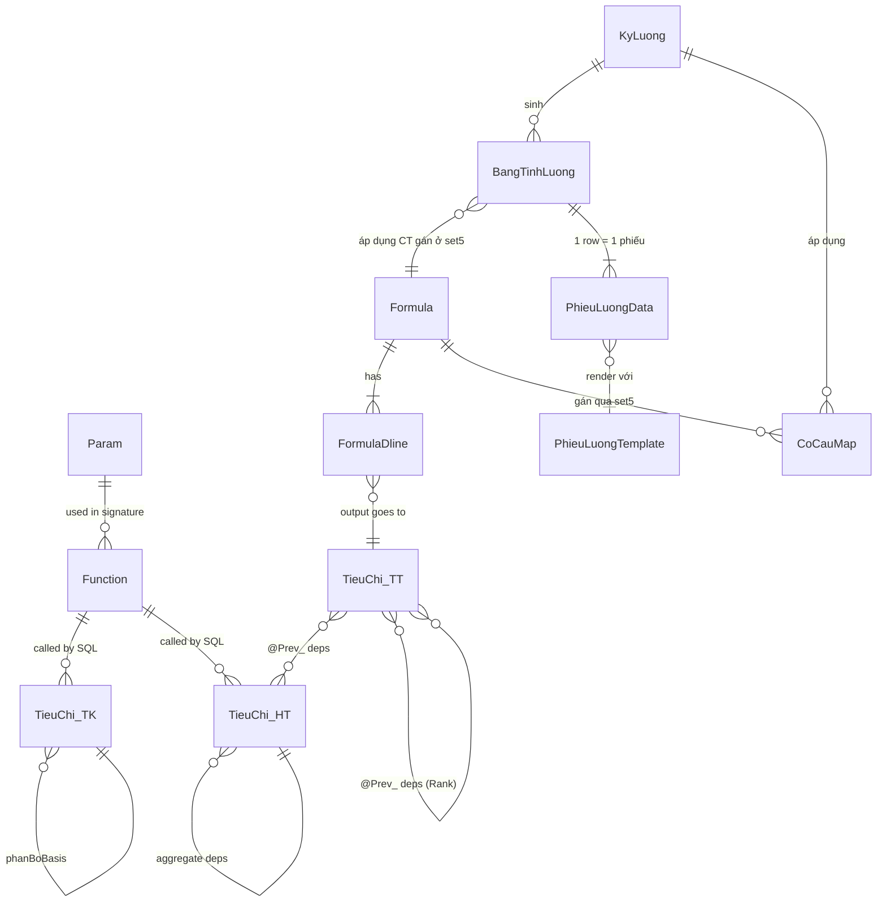

# 02 — Data Model (LTG Engine)

## 1. Naming Convention

| Prefix | Ý nghĩa | Kiểu | Ví dụ |
|--------|---------|------|-------|
| `@X`   | Param scalar (input cho function) | varies | `@EmpID`, `@KyID`, `@ToDate` |
| `@Prev_<Mã>` | Kết quả tiêu chí Rank thấp hơn (template động) | theo output tiêu chí đích | `@Prev_HT_TS_CongThucTe` |
| `TK_`  | Tiêu chí tìm kiếm — output **string/datetime**, dùng cho CASE WHEN, filter | `nvarchar` / `datetime` | `TK_ThangLuong`, `TK_BPTL` |
| `HT_`  | Tiêu chí hệ thống — output **numeric raw** từ HR/Chấm công/BH | `float` | `HT_TG_TrongGio`, `HT_HeSoBHXH` |
| `TT_`  | Tiêu chí tính toán — output **numeric computed**, có Rank & Dependency | `float` | `TT_TLTGTrongGio`, `TT_TruBHXH` |
| `AGG_` | Cross-row aggregate (SUM/MAX qua các dòng của cùng NV cùng kỳ) | `float` | `AGG_MaxLuongGopKy` |
| `HR_fn*`  | Function scalar từ module HR core Millennium | scalar | `dbo.HR_fnGetHoTen` |
| `PR_LSP_fn*` | Function scalar do LSP/LTG extension MPHG viết | scalar | `dbo.PR_LSP_fnGetDonGia` |
| `PIT_fn*` | Function scalar module Thuế | scalar | `dbo.PIT_fnCalcThue` |
| `PTS_fn*` | Function scalar module Chấm công | scalar | `dbo.PTS_fnGetCaChinh` |

## 2. Entities

### 2.1 `Param` — Danh mục Param hệ thống (set0)

| Field | Type | Mandatory | Sample |
|-------|------|-----------|--------|
| `ma` | `varchar(30)` PK | Y | `@EmpID` |
| `kieu` | `varchar(50)` | Y | `varchar(20)` / `float` / `date` |
| `mucDich` | `nvarchar(255)` | Y | `Mã nhân viên đang xử lý` |
| `khaDung` | `nvarchar(50)` | Y | `Luôn có` / `Khi NV có quá trình` |
| `viDu` | `nvarchar(500)` | Y | `dbo.HR_fnGetDonVi(@EmpID, @ToDate, 3)` |
| `viDuSoLieu` | `nvarchar(255)` | O | `'1022907668'` |
| `trangThai` | `enum` | Y | `Đang dùng` / `Dự phòng` / `Engine internal` |
| `ghiChu` | `nvarchar(1000)` | O | HTML markup cho phép |

**Constraint**:
- `ma` bắt buộc bắt đầu bằng `@`; regex `^@[A-Za-z_][A-Za-z0-9_]*(\<Mã\>)?$`
- `@Prev_<Mã>` là **template động** — engine tự parse `regex /@Prev_[A-Z]+_[A-Za-z0-9_]+/gi` từ SQL để build dependency graph.
- Chỉ xóa được param `trangThai = Dự phòng` (Đang dùng và Engine internal cấm xóa).

**Sample size**: ~35 param (28 Đang dùng + 5 Dự phòng + 2 Engine internal).

### 2.2 `Function` — Danh mục Function scalar (set-fn)

| Field | Type | Mandatory | Sample |
|-------|------|-----------|--------|
| `ten` | `varchar(200)` PK | Y | `dbo.HR_fnGetHoTen` |
| `nhom` | `enum` | Y | `HR core` / `Chấm công` / `Sản lượng` / `Định mức` / `Khoản trừ/Thuế` / `Phụ cấp` |
| `moduleDung` | `enum` | Y | `set1` / `set2` / `both` |
| `mucDich` | `nvarchar(500)` | Y | `Lấy họ tên NV tại thời điểm ...` |
| `params` | `nvarchar(500)` | Y | `@EmpID varchar(20), @Date date` |
| `returnType` | `varchar(50)` | Y | `nvarchar(255)` / `decimal(18,2)` |
| `viDuSql` | `nvarchar(500)` | Y | `dbo.HR_fnGetHoTen('1022907668','2026-05-31')` |
| `viDuKq` | `nvarchar(255)` | O | `Nguyễn Thị Loan` |
| `cot` | `varchar(30)` | O | `C05` (map bảng Excel gốc) |
| `loai` | `enum` | Y | `Scalar` / `iTVF` / `mTVF` |
| `trangThai` | `enum` | Y | `Đề xuất` / `Đang phát triển` / `Đã có` / `Chưa cần` |

**Sample size**: 37 function (target). Thực tế `Đã có`: ~24, `Đang phát triển`: ~8, `Đề xuất`: ~5.

#### 2.2.a Function scalar phục vụ Cross-row & Trần BH (LTG core)

4 function bắt buộc cho engine LTG Pha-2 (cross-row aggregation) — trạng thái `Đang dùng`. Return `decimal(18,2)` để tránh round-off khi so sánh trần BH biên (float xấp xỉ VD `72,800,000.00001` vs `72,800,000`):

| Function | Params | Return | Purpose | Sample |
|---|---|---|---|---|
| `dbo.PR_LSP_fnGetMaxLuongGopKy` | `@EmpID varchar(20), @KyID varchar(30)` | `decimal(18,2)` | Trả **giá trị TotalIncome lớn nhất** của NV trong kỳ (gom mọi dòng lương). Dùng để trích BH 1 lần trên dòng MAX (BR-01). | `8,500,000.00` |
| `dbo.PR_LSP_fnGetSumTNChiuThueKy` | `@EmpID varchar(20), @KyID varchar(30)` | `decimal(18,2)` | **Tổng thu nhập chịu thuế toàn kỳ** của NV (SUM `TotalIncome` các dòng, đã trừ khoản miễn thuế). Dùng tính thuế tạm trích tháng 1 lần (BR-02). | `12,300,000.00` |
| `dbo.PR_fnGetTrichBH_RowV2` | `@EmpID varchar(20), @KyID varchar(30), @LuotDong int` | `decimal(18,2)` | Trích BH per-row: **> 0 chỉ khi row là dòng MAX** (matched với `PR_LSP_fnGetMaxLuongGopKy`); các dòng còn lại trả `0`. Auto cap `min(LuongMax, PR_fnGetTranBHVung)`. **V1 legacy** `PR_fnGetTrichBH_Row(@EmpID,@PRMonth,@PRYear,@RowIndex)` giữ nguyên cho LSP/LNS backward-compat. | `8,500,000.00` / `0.00` |
| `dbo.PR_fnGetTranBHVung` | `@EmpID varchar(20), @Date date` | `decimal(18,2)` | **MỚI** — Trần lương đóng BH theo vùng của NV tại `@Date`: lookup NV → Đơn vị → Vùng (I/II/III/IV) → LTT vùng × 20. **KHÔNG hardcode** — KH cấu hình mức trần & LTT vùng ở màn HR data / Salary Config (ngoài scope LTG core). | `72,800,000.00` (vùng III, 2026) |

**Ghi chú**:
- `PR_fnGetTrichBH_RowV2` được gọi engine set trong Pha-2 sau khi Pha-1 (per-row) đã chạy xong; auto biết `@LuotDong` nào là MAX. **V1 legacy** `PR_fnGetTrichBH_Row(@EmpID,@PRMonth,@PRYear,@RowIndex)` giữ nguyên cho LSP/LNS backward-compat, không tự retire.
- `PR_fnGetTranBHVung` là **hợp đồng cứng** giữa LTG engine và module Salary Config: engine chỉ gọi function, không truy cứng bảng LTT/vùng.
- Khi LTT vùng thay đổi (thường 1/7 hằng năm), KH chỉ update ở HR data — engine tự áp dụng ở kỳ kế tiếp không cần deploy code.
- Return type `decimal(18,2)` (không `float`): tiền tệ chính xác 2 chữ số, tránh xấp xỉ float ở cận biên trần vùng.

### 2.3 `TieuChi_TK` — Tiêu chí tìm kiếm (set1)

| Field | Type | Mandatory | Sample |
|-------|------|-----------|--------|
| `ma` | `varchar(100)` PK | Y | `TK_BPTL` |
| `tenVI` | `nvarchar(255)` | Y | `Bộ phận tính lương` |
| `tenEN` | `nvarchar(255)` | O | `Payroll Department` |
| `rank` | `int` | Y | 1 |
| `kieu` | `enum` | Y | `nvarchar` / `datetime` |
| `sql` | `nvarchar(2000)` | Y | `dbo.HR_fnGetBPTL(@EmpID, @ToDate)` |
| `phanBo` | `enum` | Y | `slice` / `last` / `first` / `maxby` / `minby` |
| `phanBoBasis` | `varchar(100)` | R (maxby/minby) | `HT_TS_CongThucTe` |
| `use` | `bit` | Y | 1 |

**Sample size**: 19 items (10 nvarchar + 9 datetime).

### 2.4 `TieuChi_HT` — Tiêu chí hệ thống (set2)

Structure giống TK_, khác:
- `kieu` = `float` mặc định (numeric raw).
- Bổ sung: `calcLevel` (`PerSlice` / `PerEmployee` / `Aggregate`), `aggregateScope` (`Ban/Ka/Dept/CrossDept`), `aggregateOp` (`Sum/Avg/Max/Min`).
- **Sample size**: 33 items.

### 2.5 `TieuChi_TT` — Tiêu chí tính toán (set3)

| Field | Type | Mandatory | Sample |
|-------|------|-----------|--------|
| `ma` | `varchar(100)` PK | Y | `TT_TLTGTrongGio` |
| `tenVI` | `nvarchar(255)` | Y | `Tiền lương thời gian trong giờ` |
| `tenEN` | `nvarchar(255)` | O | `In-hour salary` |
| `rank` | `int` | Y | 3 |
| `rowClass` | `enum` | Y | `Info` / `Detail` / `Summary` |
| `allocation` | `enum` | Y | `None` / `Prorata` / `OldStage` / `NewStage` / `MaxSalaryRow` / `LastStageRow` / `Accumulate` |
| `allowSumPrev` | `bit` | Y | 0 |
| `priority` | `int` | Y | 20 |
| `use` | `bit` | Y | 1 |

**Note**: TT_ **KHÔNG chứa công thức** trực tiếp — công thức được nhập ở set4 (Dline).

**Sample size**: 49 items.

### 2.6 `Formula` — Công thức lương (set4)

Header:
| Field | Type | Mandatory | Sample |
|-------|------|-----------|--------|
| `formulaId` | `bigint` PK IDENTITY | Y | 1001 |
| `name` | `nvarchar(255)` | Y | `Lương Thời Gian - Chế biến` |
| `customer` | `varchar(50)` | Y | `MPHG` |
| `rowGenMode` | `enum` | Y | `ByWorkHistory` |
| `ghiChu` | `nvarchar(1000)` | O | — |

Dline (chi tiết):
| Field | Type | Mandatory | Sample |
|-------|------|-----------|--------|
| `formulaId` | `bigint` FK | Y | 1001 |
| `stt` | `int` | Y | 1 |
| `maTieuChi` | `varchar(100)` FK→TieuChi_TT | Y | `TT_TLTGTrongGio` |
| `sttThuTu` | `int` | Y | 10 |
| `congThuc` | `nvarchar(2000)` | Y | `HT_TG_TrongGio * HT_DonGiaGio + HT_PhuCap` |
| `reduceOp` | `enum` | O | `SUM` / `MAX` / `MIN` / `AVG` |
| `loaiTinh` | `nvarchar(50)` read-only | derived | `Detail / Prorata` |

### 2.7 `KyLuong` — Kỳ lương (set-taokyluong)

| Field | Type | Mandatory | Sample |
|-------|------|-----------|--------|
| `kyId` | `varchar(30)` PK | Y | `KY_202605_LTG` |
| `tenKy` | `nvarchar(255)` | Y | `Kỳ lương tháng 5/2026 - LTG` |
| `loaiKy` | `enum` | Y | `LTG` / `LSP` / `LNS` / `Ky13` / `DieuChinh` |
| `thang` | `tinyint` | Y | 5 |
| `nam` | `smallint` | Y | 2026 |
| `fromDate` | `date` | Y | 2026-05-01 |
| `toDate` | `date` | Y | 2026-05-31 |
| `bpApDung` | `nvarchar(MAX)` multi-select | Y | `[CB101, CB102, ...]` |
| `ntl1` | `varchar(20)` | O | `NTL_A` |
| `ntl2` | `varchar(20)` | O | — |
| `ntl3` | `varchar(20)` | O | — |
| `bptl` | `nvarchar(MAX)` multi-select | Y | `[BPTL_001, BPTL_002]` |
| `trangThai` | `enum` | Y | `Nháp` / `Đã tạo` / `Đang tính` / `Đã tính` / `Đã khóa` |

### 2.8 `BangTinhLuong` — Kết quả lương (set7)

Grid kết quả — **1 row = 1 dòng lương** (NV × Kỳ × BPTL).

| Field | Type | Mandatory | Sample |
|-------|------|-----------|--------|
| `rowId` | `bigint` PK | Y | 90001 |
| `kyId` | `varchar(30)` FK | Y | `KY_202605_LTG` |
| `empId` | `varchar(20)` | Y | `1022907668` |
| `luotDong` | `int` | Y | 1 |
| `totalLuot` | `int` | Y | 2 |
| `bptl` | `varchar(20)` | Y | `CB101` |
| `sliceFromDate` | `date` | Y | 2026-05-01 |
| `sliceToDate` | `date` | Y | 2026-05-15 |
| `TK_*` | dynamic | — | 19 cột string/date |
| `HT_*` | `float` | — | 33 cột numeric raw (VD `HT_TG_TrongGio = 162.56`) |
| `TT_*` | `float` | — | 49 cột numeric computed (VD `TT_TLTGTrongGio = 5689600`) |
| `TotalIncome` | `float` | Y | 8500000 |
| `TruBH` | `float` | Y | 892500 (10.5% × min(luong, 20×LTT)) |
| `TruThue` | `float` | Y | 0 (dòng phi-MaxLuong) hoặc value ở dòng cuối |
| `NetIncome` | `float` | Y | 7607500 |
| `daKhoa` | `bit` | Y | 0 |
| `khoaBy` | `varchar(50)` | O | `HR_PAYROLL_01` |
| `khoaAt` | `datetime` | O | 2026-06-05 09:15:22 |

**Total column dynamic**: ~26 cột hiển thị mặc định trên grid set7 (do BA cấu hình ở set-gancotluong).

### 2.9 `PhieuLuongTemplate` — Template phiếu (set12)

| Field | Type | Mandatory | Sample |
|-------|------|-----------|--------|
| `templateId` | `bigint` PK | Y | 501 |
| `tenTemplate` | `nvarchar(255)` | Y | `Phiếu lương chuẩn A4 MPHG` |
| `loai` | `enum` | Y | `Word` / `Excel` / `HTML` |
| `filePath` | `varchar(500)` | Y | `/templates/phieu-lung-mphg-a4.docx` |
| `placeholderList` | `nvarchar(MAX)` JSON | Y | `["«EmpName»", "«HT_HeSoBHXH»", ...]` |
| `trangThai` | `enum` | Y | `Đang dùng` / `Ngừng` |

### 2.10 `PhieuLuongData` — Data render (per row phiếu)

Snapshot đóng băng lúc publish — mọi placeholder đã resolve.

| Field | Type | Sample |
|-------|------|--------|
| `phieuId` | `bigint` PK | 900001 |
| `rowId` | `bigint` FK→BangTinhLuong | 90001 |
| `pageIndex` | `int` | 1 |
| `totalPages` | `int` | 2 |
| `dataJson` | `nvarchar(MAX)` | `{"EmpName":"Nguyễn Thị Loan","HT_HeSoBHXH":4.5,...}` |
| `publishedAt` | `datetime` | 2026-06-05 |
| `publishedBy` | `varchar(50)` | `HR_PAYROLL_01` |

## 3. ERD (Mermaid)



## 4. Kỳ mẫu — Sample data (05/2026, `1022907668`)

```javascript
KyLuong = {
  kyId: 'KY_202605_LTG',
  thang: 5, nam: 2026,
  fromDate: '2026-05-01', toDate: '2026-05-31',
  bptl: ['CB101', 'CB102'],
  trangThai: 'Đã tính'
}

BangTinhLuong = [
  { rowId: 90001, empId: '1022907668', luotDong: 1, totalLuot: 2,
    bptl: 'CB101', sliceFromDate: '2026-05-01', sliceToDate: '2026-05-15',
    HT_TG_TrongGio: 80.0, HT_DonGiaGio: 35000,
    TT_TLTGTrongGio: 2800000,
    TotalIncome: 3900000, TruBH: 0, TruThue: 0,   // BH dồn dòng MAX (dòng 2)
    NetIncome: 3900000 },
  { rowId: 90002, empId: '1022907668', luotDong: 2, totalLuot: 2,
    bptl: 'CB102', sliceFromDate: '2026-05-16', sliceToDate: '2026-05-31',
    HT_TG_TrongGio: 82.56, HT_DonGiaGio: 35000,
    TT_TLTGTrongGio: 2889600,
    TotalIncome: 4600000,
    TruBH: 892500,      // trích 1 lần cho dòng MAX
    TruThue: 145000,    // thuế TNCN tính trên (3.9tr + 4.6tr) rồi dồn dòng cuối
    NetIncome: 3562500 }
]
```

## 5. Constraints & Indexes (SQL)

```sql
CREATE UNIQUE INDEX UX_BTL_Ky_Emp_Luot ON BangTinhLuong(kyId, empId, luotDong);
CREATE INDEX IX_BTL_Ky_Bptl ON BangTinhLuong(kyId, bptl);
CREATE INDEX IX_BTL_Emp_Time ON BangTinhLuong(empId, sliceFromDate, sliceToDate);
CREATE INDEX IX_Formula_Customer_Name ON Formula(customer, name);
CREATE UNIQUE INDEX UX_TieuChi_Ma ON TieuChi_TT(ma);
```
