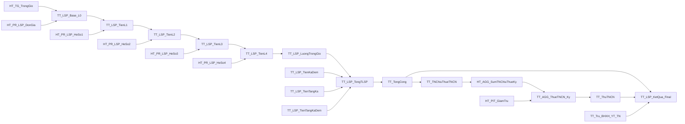

# LTG · Catalog Reference — Toàn bộ danh sách item Engine

> **File này là auto-extracted catalog từ prototype mock data** (`lsp/set0-*.html`, `lsp/set-function-catalog.html`, `lsp/set1-*.html`, `lsp/set2-*.html`, `lsp/set3-*.html`, `lsp/set4-*.html`).
> Nội dung cần review lần cuối với KH trước khi finalize FSD.
> Cross-reference: `02-data-model.md` (schema/rule), `03-luong-setup-engine.md` (UI/context), `07-business-rules-integration.md` (rules & integration).

## ⚠️ Ghi chú Coverage vs. Spec ban đầu

| Loại | Spec dự kiến | Actual mock | Ghi chú |
|------|--------------|-------------|---------|
| Params | ~35 | **32** | Mock hiện có 32; các param dự phòng NTL2/NTL3/BPBK/QCTL/TienTrinh đã bao gồm |
| Functions | 37 | **37** ✓ | Match |
| TK_ | 19 | **18** | Mock chỉ có 18 items (số thứ tự bỏ 7 do `TK_HR_DuCong` đã chuyển sang HT_) |
| HT_ | 33 | **42** | Mock đã mở rộng thêm Phase 2 (HR core 5 + Chấm công 4 + Thời gian 9 + HeSo 3 + Bổ sung 5 + AGG 3 + DuCong 1) |
| TT_ | 49 | **57** | Mock có thêm 8 items thuộc Section B/C/E/F/G/H đã bổ sung Phase 2 |
| Công thức | N | **1** | Chỉ có 1 sample `LSP_01` với 6 dline — mock nhẹ, chờ KH bổ sung |
| **TỔNG** | 143+ | **167** | Vượt spec do Phase 2 mở rộng |

---

## Mục lục

1. [Params (32 items)](#1-params)
2. [Functions scalar (37 items)](#2-functions)
3. [Tiêu chí TK_ Tìm kiếm (18 items)](#3-tieu-chi-tk)
4. [Tiêu chí HT_ Hệ thống (42 items)](#4-tieu-chi-ht)
5. [Tiêu chí TT_ Tính toán (57 items)](#5-tieu-chi-tt)
6. [Công thức mẫu (1 item)](#6-cong-thuc)
7. [Cross-reference matrix](#7-cross-ref)

---

<a id="1-params"></a>
## 1. Params

**Định nghĩa**: Biến toàn cục engine truyền vào function scalar. Prefix `@`. Naming: `@<Category>_<Mã>` hoặc `@<Ma>`. Nguồn: `lsp/set0-param-hethong.html` → `MOCK_PARAMS`.

### 1.1 Bảng chi tiết

| # | Mã | Kiểu | Mục đích | Khả dụng | Ví dụ code | Ví dụ số liệu | Trạng thái | Ghi chú |
|---|----|------|----------|----------|------------|---------------|-------------|---------|
| 1 | `@EmpID` | varchar(20) | Mã nhân viên đang xử lý | Luôn có | `dbo.HR_fnGetDonVi(@EmpID, @ToDate, 3)` | `'1022907668'` → Nguyễn Thị Loan | Đang dùng | |
| 2 | `@DeptID` | varchar(20) | Mã bộ phận hiện tại của NV | Luôn có | `dbo.PR_LSP_fnGetHoTroBP(@DeptID, @PRMonth)` | `'CB101'` (GĐ1) hoặc `'CB102'` (GĐ2) | Đang dùng | |
| 3 | `@PRMonth` | int | Tháng kỳ lương (1-12) | Luôn có | `dbo.PR_LSP_fnGetCongChuan(@PRMonth, @PRYear)` | `5` | Đang dùng | |
| 4 | `@PRYear` | int | Năm kỳ lương | Luôn có | `dbo.PR_LSP_fnGetCongChuan(@PRMonth, @PRYear)` | `2026` | Đang dùng | |
| 5 | `@KyID` | varchar(30) | Mã kỳ lương duy nhất (định danh nghiệp vụ) | Luôn có | `dbo.PR_LSP_fnGetTongLuongKy(@EmpID, @KyID)` | `'KY_202605_LSP'` | Đang dùng | Derive từ set-taokyluong. Dùng cho aggregate cross-row cùng kỳ, audit trail, truy vấn liên kỳ chính xác hơn @PRMonth/@PRYear |
| 6 | `@ToDate` | date | Ngày cuối kỳ lương | Luôn có | `dbo.HR_fnGetDonVi(@EmpID, @ToDate, 3)` | `'31/05/2026'` | Đang dùng | Dùng cho Phân bổ = Mới nhất |
| 7 | `@FromDate` | date | Ngày đầu kỳ lương | Luôn có | `dbo.HR_fnGetDonVi(@EmpID, @FromDate, 3)` | `'01/05/2026'` | Đang dùng | Dùng cho Phân bổ = Cũ nhất |
| 8 | `@SliceFromDate` | date | Ngày đầu giai đoạn QTLV | Khi NV có QTLV | `dbo.PTS_fnGetCongSlice(@EmpID, @SliceFromDate, @SliceToDate)` | GĐ1: `'01/05/2026'`, GĐ2: `'16/05/2026'` | Đang dùng | NV chỉ có 1 GĐ → = @FromDate |
| 9 | `@SliceToDate` | date | Ngày cuối giai đoạn QTLV | Khi NV có QTLV | `dbo.HR_fnGetDonVi(@EmpID, @SliceToDate, 3)` | GĐ1: `'15/05/2026'`, GĐ2: `'31/05/2026'` | Đang dùng | Dùng cho Phân bổ = Theo giai đoạn |
| 10 | `@BPTL` | varchar(20) | Mã bộ phận tính lương | Luôn có | `dbo.PR_LSP_fnGetDonGia(@BPTL, @CongDoanMa)` | `'BPTL_001'` | Đang dùng | |
| 11 | `@NTL` | varchar(20) | Mã nhóm tính lương | Luôn có | `dbo.PR_LSP_fnGetHeSo(@NTL, @PRMonth)` | `'NTL_A'` | Đang dùng | |
| 12 | `@CongDoanMa` | varchar(20) | Mã công đoạn sản xuất | Luôn có | `dbo.PR_LSP_fnGetDonGia(@BPTL, @CongDoanMa)` | `'CD01'` | Đang dùng | |
| 13 | `@DeptL1..L5` | nvarchar(100) | Tên đơn vị cấp 1 → cấp 5 (5 param riêng) | Luôn có | `dbo.PR_LSP_fnGetBQ_VS(@DeptL3)` | `@DeptL1='Cty MPHG'`, `@DeptL2='NM Cà Mau'`, `@DeptL3='PX Chế biến 2'`, `@DeptL4='Ca 1'`, `@DeptL5='CB101'` | Đang dùng | 5 param riêng biệt |
| 14 | `@SliceIndex` | int | Số thứ tự giai đoạn QTLV (1, 2, 3...) | Khi NV có QTLV | `CASE WHEN @SliceIndex = 1 THEN ...` | GĐ1: `1`, GĐ2: `2` | Đang dùng | |
| 15 | `@TotalSlices` | int | Tổng số giai đoạn QTLV trong kỳ | Khi NV có QTLV | `CASE WHEN @SliceIndex = @TotalSlices THEN ...` | `2` | Đang dùng | Dùng kết hợp @SliceIndex để nhận biết GĐ cuối |
| 16 | `@Prev_<Mã>` | float/nvarchar/datetime | Kết quả tiêu chí có Rank thấp hơn (thay <Mã> = mã tiêu chí đích) | Khi tiêu chí Rank>1 | `dbo.PR_LSP_fnGetHeSo(@Prev_HT_TS_CongThucTe, @EmpID, @PRMonth)` | `@Prev_HT_TS_CongThucTe = 22.5` | Đang dùng | **Template động** — engine auto-parse regex `@Prev_<Mã>` từ SQL để build dependency graph. Kiểu = kiểu output của tiêu chí đích |
| 17 | `@CompanyID` | varchar(20) | Mã công ty | Luôn có | `dbo.PR_fnGetLuongCoSo(@CompanyID, @PRMonth)` | `'MPHG'` | Đang dùng | Phân biệt chính sách lương theo công ty |
| 18 | `@KaID` | varchar(20) | Mã ca làm việc (Ka) | Luôn có | `dbo.PR_LSP_fnGetBQ_Ka(@BPTL, @KaID)` | `'KA_SANG'` | Đang dùng | Ka sáng / Ka chiều |
| 19 | `@BanID` | varchar(20) | Mã bàn / dây chuyền | Luôn có | `dbo.PR_LSP_fnGetMax_Ban(@BanID)` | `'CB101'` | Đang dùng | Dùng cho Aggregate group theo Bàn |
| 20 | `@TaxYear` | int | Năm thuế TNCN | Luôn có | `dbo.PIT_fnGetGiamTru(@EmpID, @TaxYear)` | `2026` | Đang dùng | Có thể khác @PRYear khi kỳ T12 tính thuế năm sau |
| 21 | `@NVID` | varchar(20) | Mã NV (alias của @EmpID theo module cũ) | Luôn có | `dbo.HR_fnGetThongTinNV(@NVID)` | `'1022907668'` (= @EmpID) | Đang dùng | Khuyến nghị ưu tiên @EmpID cho function mới |
| 22 | `@NTL2` | varchar(20) | Mã nhóm tính lương cấp 2 | Luôn có | `dbo.PR_LSP_fnGetHeSoNTL2(@NTL2, @PRMonth)` | *(chưa có mẫu)* | **Dự phòng** | Con của @NTL, chờ nghiệp vụ xác nhận có 3 cấp hay không |
| 23 | `@NTL3` | varchar(20) | Mã nhóm tính lương cấp 3 | Luôn có | `dbo.PR_LSP_fnGetDonGiaNTL3(@NTL3, @CongDoanMa)` | *(chưa có mẫu)* | **Dự phòng** | Con của @NTL2 |
| 24 | `@BPBK` | varchar(20) | Mã bộ phận bảng kê | Luôn có | `dbo.PR_LSP_fnGetTongLSP_BPBK(@BPBK, @PRMonth)` | *(chưa có mẫu)* | **Dự phòng** | Chờ confirm có khác @DeptID/@BPTL không |
| 25 | `@QCTL` | varchar(20) | Mã quy cách tính lương | Luôn có | `dbo.PR_LSP_fnGetDonGiaQC(@QCTL, @CongDoanMa)` | *(chưa có mẫu)* | **Dự phòng** | Chờ confirm có trùng khái niệm với @NTL không |
| 26 | `@TienTrinh` | varchar(20) | Mã tiến trình sản xuất (Tươi/Hấp/Luộc/Chiên...) | Luôn có | `dbo.PR_LSP_fnGetNS_TienTrinh(@EmpID, @TienTrinh, @PRMonth)` | *(chưa có mẫu)* | **Dự phòng** | Đặc thù ngành thủy sản |
| 27 | `@SliceDays` | int | Số ngày trong giai đoạn hiện tại | Khi NV có QTLV | `LuongGD = LuongThang * @SliceDays / @TotalDays` | GĐ1: `15`, GĐ2: `16` | **Engine internal** | Engine tự tính từ @SliceFromDate/@SliceToDate. Khuyến nghị dùng Phân bổ đầu ra = Prorata thay vì tham chiếu thủ công |
| 28 | `@TotalDays` | int | Tổng số ngày trong kỳ lương | Luôn có | `TyLe = @SliceDays / @TotalDays` | `31` | **Engine internal** | Engine tự tính từ @FromDate/@ToDate |
| 29 | `@SliceRatio` | float | Tỷ lệ ngày GĐ / tổng ngày kỳ (0.0–1.0) | Khi NV có QTLV | `LuongGD = LuongThang * @SliceRatio` | GĐ1: `0.484`, GĐ2: `0.516` | **Engine internal** | = @SliceDays / @TotalDays |
| 30 | `@IsLastSlice` | bit | =1 nếu là GĐ cuối cùng | Khi NV có QTLV | `CASE WHEN @IsLastSlice = 1 THEN dồn phần dư END` | GĐ1: `0`, GĐ2: `1` | **Engine internal** | Hỗ trợ LastStageRow allocation |
| 31 | `@LuotDong` | int | Số thứ tự dòng lương của NV trong kỳ (1, 2, 3...) — cross-row per-row logic | Luôn có | `CASE WHEN @LuotDong = 1 THEN ...` | Dòng 1: `1`, Dòng 2: `2` | **Engine internal** | Engine inject khi loop qua các dòng lương. Khuyến nghị dùng function scalar cross-row aggregate hoặc Phân bổ đầu ra thay vì tham chiếu thủ công |
| 32 | (Note: Param `@SliceIndex`/`@TotalSlices` gần trùng ý nghĩa nhưng khác vai trò với `@LuotDong`) | | @Slice* = số GĐ QTLV của NV. @LuotDong = số dòng lương output (có thể khác GĐ khi 1 NV có nhiều BPTL) | | | | | |

### 1.2 Nhóm theo Trạng thái

- **Đang dùng** (26 items): `@EmpID`, `@DeptID`, `@PRMonth`, `@PRYear`, `@KyID`, `@ToDate`, `@FromDate`, `@SliceFromDate`, `@SliceToDate`, `@BPTL`, `@NTL`, `@CongDoanMa`, `@DeptL1..L5` (5), `@SliceIndex`, `@TotalSlices`, `@Prev_<Mã>`, `@CompanyID`, `@KaID`, `@BanID`, `@TaxYear`, `@NVID`
- **Dự phòng** (5 items): `@NTL2`, `@NTL3`, `@BPBK`, `@QCTL`, `@TienTrinh`
- **Engine internal** (5 items): `@SliceDays`, `@TotalDays`, `@SliceRatio`, `@IsLastSlice`, `@LuotDong`

---

<a id="2-functions"></a>
## 2. Functions

**Định nghĩa**: SQL Scalar function được engine gọi trong tiêu chí. Prefix theo module (`HR_fn*`, `PTS_fn*`, `PIT_fn*`, `PR_LSP_fn*`, `PR_fn*`). Nguồn: `lsp/set-function-catalog.html` → `MOCK_FUNCTIONS` (37 items).

### 2.1 Bảng chi tiết

| # | Tên function | Nhóm | Module | Params | Return | Mục đích | Ví dụ SQL | Ví dụ KQ | Cột | Trạng thái |
|---|--------------|------|--------|--------|--------|----------|-----------|----------|-----|-------------|
| 1 | `dbo.HR_fnGetDonVi` | HR core | set1,set2 | `@EmpID, @Date, @Level tinyint` | varchar(20) | Lấy mã đơn vị cấp N của NV tại thời điểm | `dbo.HR_fnGetDonVi('1022906420','2026-07-31',5)` | `'CB101'` | C70 | Đã có |
| 2 | `dbo.HR_fnGetTenDonVi` | HR core | set1,set2 | `@EmpID, @Date, @Level tinyint` | nvarchar(200) | Lấy tên đơn vị cấp N | `dbo.HR_fnGetTenDonVi('1022906420','2026-07-31',5)` | `'Chế biến tải 01 ka 1'` | C71 | Đề xuất |
| 3 | `dbo.HR_fnGetNhomLuong` | HR core | set1,set2 | `@EmpID, @PRMonth, @Cap tinyint` | varchar(20) | Lấy nhóm lương cấp N | `dbo.HR_fnGetNhomLuong('1022906420',7,1)` | `'Lương CN'` | C72-C74 | Đề xuất |
| 4 | `dbo.HR_fnGetBPTinhLuong` | HR core | set1,set2 | `@EmpID, @PRMonth, @PRYear` | varchar(20) | Lấy bộ phận tính lương | `dbo.HR_fnGetBPTinhLuong('1022906420',7,2026)` | `'CB'` | C75 | Đề xuất |
| 5 | `dbo.HR_fnGetBPGom` | HR core | set1,set2 | `@EmpID, @PRMonth, @PRYear` | varchar(20) | BP gom (bảng kê) | `dbo.HR_fnGetBPGom('1022906420',7,2026)` | `'Chế Biến'` | C76 | Đề xuất |
| 6 | `dbo.HR_fnGetHeSoBHXH` | HR core | set2 | `@EmpID, @Date` | decimal(6,3) | Hệ số BHXH | `dbo.HR_fnGetHeSoBHXH('1022906420','2026-07-31')` | `1.103` | C05 | Đề xuất |
| 7 | `dbo.HR_fnGetLuongCoBan` | HR core | set2 | `@EmpID, @Date` | decimal(18,2) | Lương cơ bản NV | `dbo.HR_fnGetLuongCoBan('1022906420','2026-07-31')` | `4650000` | (input) | Đã có |
| 8 | `dbo.PTS_fnGetCongChiTietNgay` | Chấm công | set2 | `@EmpID, @FromDate, @ToDate` | decimal(6,2) | Số công thực tế | `dbo.PTS_fnGetCongChiTietNgay('1022906420','2026-07-01','2026-07-31')` | `20.4` | C06 | Đã có |
| 9 | `dbo.PTS_fnGetGioLV` | Chấm công | set2 | `@EmpID, @FromDate, @ToDate, @Loai varchar(20)` | decimal(9,2) | Giờ LV theo loại | `dbo.PTS_fnGetGioLV('1022906420','2026-07-01','2026-07-31','TRONG_GIO')` | `162.56` | C22-C27 | Đề xuất |
| 10 | `dbo.PTS_fnGetGioNgungViec` | Chấm công | set2 | `@EmpID, @FromDate, @ToDate, @Loai` | decimal(9,2) | Giờ ngừng việc | `dbo.PTS_fnGetGioNgungViec('1022906420','2026-07-01','2026-07-31','GIUA_CA')` | `5.0` | C29-C30 | Đề xuất |
| 11 | `dbo.PTS_fnGetSoPhanAn` | Chấm công | set2 | `@EmpID, @FromDate, @ToDate` | int | Số phần ăn cơm | `dbo.PTS_fnGetSoPhanAn('1022906420','2026-07-01','2026-07-31')` | `25` | C07 | Đề xuất |
| 12 | `dbo.PTS_fnGetPhepNam` | Chấm công | set2 | `@EmpID, @PRYear int, @Loai varchar(10)` | decimal(5,2) | Phép năm theo loại | `dbo.PTS_fnGetPhepNam('1022906420',2026,'CHE_DO')` | `14.0` | C68-C69 | Đề xuất |
| 13 | `dbo.PTS_fnGetCongNghiLe` | Chấm công | set2 | `@EmpID, @PRMonth, @PRYear, @LoaiLe tinyint` | decimal(5,2) | Công nghỉ Lễ | `dbo.PTS_fnGetCongNghiLe('1022906420',7,2026,1)` | `0` | C78-C79 | Đề xuất |
| 14 | `dbo.PR_LSP_fnGetNS` | Sản lượng | set2 | `@EmpID, @BPTL, @CongDoanMa, @FromDate, @ToDate` | decimal(18,4) | Năng suất cá nhân | `dbo.PR_LSP_fnGetNS('1022906420','CB','CD01','2026-07-01','2026-07-31')` | `12450.5000` | (input C13) | Đã có |
| 15 | `dbo.PR_LSP_fnGetTongLSP_Dept` | Sản lượng | set2 | `@DeptID, @BPTL, @PRMonth` | decimal(18,2) | Tổng LSP đơn vị (aggregate cross-NV) | `dbo.PR_LSP_fnGetTongLSP_Dept('CB101','CB',7)` | `856000000` | (aggr) | Đã có |
| 16 | `dbo.PR_LSP_fnGetTongCong_Dept` | Sản lượng | set2 | `@DeptID, @BPTL, @PRMonth` | decimal(9,2) | Tổng công đơn vị | `dbo.PR_LSP_fnGetTongCong_Dept('CB101','CB',7)` | `540.5` | (aggr) | Đã có |
| 17 | `dbo.PR_LSP_fnGetBinhQuan_Ka` | Sản lượng | set2 | `@KaID, @BPTL, @PRMonth` | decimal(18,2) | Bình quân theo ca (aggregate cross-NV) | `dbo.PR_LSP_fnGetBinhQuan_Ka('KA_SANG','CB',7)` | `6250000` | (aggr) | Đã có |
| 18 | `dbo.PR_LSP_fnGetDonGia` | Định mức | set2 | `@EmpID, @BPTL, @CongDoanMa, @FromDate, @ToDate` | decimal(18,4) | Đơn giá công đoạn | `dbo.PR_LSP_fnGetDonGia('1022906420','CB','CD01','2026-07-01','2026-07-31')` | `385.0000` | (input C13) | Đã có |
| 19 | `dbo.PR_LSP_fnGetHeSo` | Định mức | set2 | `@Prev_HT_TS_CongThucTe, @EmpID, @PRMonth, @Lan tinyint` | decimal(6,3) | Hệ số điều chỉnh | `dbo.PR_LSP_fnGetHeSo(22.5,'1022906420',7,1)` | `1.085` | (hệ số ĐC) | Đã có |
| 20 | `dbo.PR_LSP_fnGetCongChuan` | Định mức | set2 | `@PRMonth, @PRYear` | decimal(5,2) | Công chuẩn tháng | `dbo.PR_LSP_fnGetCongChuan(7,2026)` | `26.0` | (input) | Đã có |
| 21 | `dbo.PR_fnGetLuongToiThieuVung` | Định mức | set2 | `@Vung tinyint, @Date` | decimal(18,2) | Lương tối thiểu vùng | `dbo.PR_fnGetLuongToiThieuVung(2,'2026-07-31')` | `4160000` | C20 | Đề xuất |
| 22 | `dbo.PR_LSP_fnGetHoTro_QCSX` | Định mức | set2 | `@BPTL, @NhomLuong, @PRMonth` | decimal(6,3) | Hỗ trợ QCSX | `dbo.PR_LSP_fnGetHoTro_QCSX('CB','LCN',7)` | `0.05` | C15 | Đề xuất |
| 23 | `dbo.PR_fnGetKhoanTruThang` | Khoản trừ/Thuế | set2 | `@EmpID, @PRMonth, @PRYear` | decimal(18,2) | Tổng khoản trừ tháng | `dbo.PR_fnGetKhoanTruThang('1022906420',7,2026)` | `479474` | C56 | Đã có |
| 24 | `dbo.PIT_fnGetGiamTru` | Khoản trừ/Thuế | set2 | `@EmpID, @TaxYear` | decimal(18,2) | Giảm trừ thuế | `dbo.PIT_fnGetGiamTru('1022906420',2026)` | `15400000` | (input thuế) | Đề xuất |
| 25 | `dbo.PR_fnGetQuyTinhThuong` | Khoản trừ/Thuế | set2 | `@EmpID, @PRMonth, @PRYear` | decimal(18,2) | Quỹ tình thương | `dbo.PR_fnGetQuyTinhThuong('1022906420',7,2026)` | `10000` | C58 | Đề xuất |
| 26 | `dbo.PR_LSP_fnGetPhuCapKy` | Phụ cấp | set2 | `@EmpID, @PRMonth, @LoaiPC varchar(20)` | decimal(18,2) | Phụ cấp theo loại | `dbo.PR_LSP_fnGetPhuCapKy('1022906420',7,'PHA_XANG')` | `84000` | C43 | Đã có |
| 27 | `dbo.PR_LSP_fnGetHoTro_CNMoi` | Phụ cấp | set2 | `@EmpID, @PRMonth, @PRYear` | decimal(18,2) | Hỗ trợ CN mới | `dbo.PR_LSP_fnGetHoTro_CNMoi('1022906420',7,2026)` | `0` | C14, C50 | Đề xuất |
| 28 | `dbo.HR_fnGetHoTen` | HR core | set1 | `@EmpID, @Date` | nvarchar(100) | Lấy họ tên NV tại thời điểm | `dbo.HR_fnGetHoTen('1022906420','2026-07-31')` | `'Huỳnh Thị Nuôl'` | C01+C02 | Đề xuất |
| 29 | `dbo.HR_fnGetMaPBChiPhi` | HR core | set1 | `@EmpID, @Date` | varchar(20) | Mã phân bổ chi phí NV | `dbo.HR_fnGetMaPBChiPhi('1022906420','2026-07-31')` | `'CB-CB101'` | C70 | Đề xuất |
| 30 | `dbo.HR_fnGetSoNguoiPhuThuoc` | HR core | set2 | `@EmpID, @TaxYear` | int | Số người phụ thuộc thuế TNCN | `dbo.HR_fnGetSoNguoiPhuThuoc('1022906420',2026)` | `2` | (giảm trừ thuế) | Đề xuất |
| 31 | `dbo.PTS_fnGetCaChinh` | Chấm công | set1 | `@EmpID, @Date` | varchar(10) | Ca làm việc chính | `dbo.PTS_fnGetCaChinh('1022906420','2026-07-31')` | `'KA1'` | (filter) | Đề xuất |
| 32 | `dbo.PTS_fnGetChoTienAn` | Chấm công | set2 | `@EmpID, @PRMonth int` | int | Cờ cho tiền ăn (1/0) | `dbo.PTS_fnGetChoTienAn('1022906420',7)` | `1` | C04 | Đề xuất |
| 33 | `dbo.PIT_fnCalcThue` | Khoản trừ/Thuế | set2 | `@TNChiuThue decimal(18,2), @TaxYear, @GiamTru decimal(18,2)` | decimal(18,2) | Tính thuế TNCN progressive 7 bậc | `dbo.PIT_fnCalcThue(25000000, 2026, 24200000)` | `40000` | C59 | Đề xuất |
| 34 | `dbo.PR_LSP_fnGetMaxLuongGopKy` ⭐ | Sản lượng | set2 | `@EmpID, @KyID varchar(30)` (FSD LTG) / `@EmpID, @PRMonth, @PRYear` (mock legacy) | decimal(18,2) | **CROSS-ROW**: MAX lương gộp của NV trong kỳ (dùng cho trích BH 1 lần trên dòng MAX) | `dbo.PR_LSP_fnGetMaxLuongGopKy('1022906002','KY_202605_LTG')` | `6200000.00` | (cross-row) | **Đang dùng** |
| 35 | `dbo.PR_LSP_fnGetSumTNChiuThueKy` ⭐ | Sản lượng | set2 | `@EmpID, @KyID varchar(30)` (FSD LTG) / `@EmpID, @PRMonth, @PRYear` (mock legacy) | decimal(18,2) | **CROSS-ROW**: SUM TN chịu thuế toàn kỳ (dùng cho thuế TNCN tạm trích tháng) | `dbo.PR_LSP_fnGetSumTNChiuThueKy('1022906002','KY_202605_LTG')` | `10700000.00` | (cross-row) | **Đang dùng** |
| 36 | `dbo.PR_fnGetTrichBH_RowV2` ⭐ | Khoản trừ/Thuế | set2 | `@EmpID, @KyID varchar(30), @LuotDong int` | decimal(18,2) | Trích BH per-row với isMax flag (chỉ dòng MAX mới trích) — gọi `PR_fnGetTranBHVung` để cap base tại `sliceToDate` của dòng MAX. **V1 legacy** `PR_fnGetTrichBH_Row(@EmpID,@PRMonth,@PRYear,@RowIndex)` giữ nguyên cho LSP/LNS backward-compat. | `dbo.PR_fnGetTrichBH_RowV2('1022906002','KY_202605_LTG',1)` | `430000.00` | C56 per-row | **Đang dùng** |
| 37 | `dbo.PR_fnGetTranBHVung` ⭐ | Khoản trừ/Thuế | set2 | `@EmpID varchar(20), @Date datetime` | decimal(18,2) | Trần lương đóng BH theo vùng của NV (NV → Đơn vị → Vùng I/II/III/IV → LTT vùng × 20). Configurable qua HR data, engine không hardcode. Return `decimal(18,2)` tránh round-off cận biên. | `dbo.PR_fnGetTranBHVung(@EmpID, @ToDate)` | `72800000.00` | (cap BH) | **Đang dùng** |

> ⭐ = Function chuyên biệt Cross-row (mới ở Phase 2)

### 2.2 Nhóm theo Prefix

- **`HR_fn*`** (10 items): `HR_fnGetDonVi`, `HR_fnGetTenDonVi`, `HR_fnGetNhomLuong`, `HR_fnGetBPTinhLuong`, `HR_fnGetBPGom`, `HR_fnGetHeSoBHXH`, `HR_fnGetLuongCoBan`, `HR_fnGetHoTen`, `HR_fnGetMaPBChiPhi`, `HR_fnGetSoNguoiPhuThuoc`
- **`PTS_fn*`** (8 items): `PTS_fnGetCongChiTietNgay`, `PTS_fnGetGioLV`, `PTS_fnGetGioNgungViec`, `PTS_fnGetSoPhanAn`, `PTS_fnGetPhepNam`, `PTS_fnGetCongNghiLe`, `PTS_fnGetCaChinh`, `PTS_fnGetChoTienAn`
- **`PR_LSP_fn*`** (12 items): `PR_LSP_fnGetNS`, `PR_LSP_fnGetTongLSP_Dept`, `PR_LSP_fnGetTongCong_Dept`, `PR_LSP_fnGetBinhQuan_Ka`, `PR_LSP_fnGetDonGia`, `PR_LSP_fnGetHeSo`, `PR_LSP_fnGetCongChuan`, `PR_LSP_fnGetHoTro_QCSX`, `PR_LSP_fnGetPhuCapKy`, `PR_LSP_fnGetHoTro_CNMoi`, `PR_LSP_fnGetMaxLuongGopKy`, `PR_LSP_fnGetSumTNChiuThueKy`
- **`PR_fn*`** (5 items): `PR_fnGetLuongToiThieuVung`, `PR_fnGetKhoanTruThang`, `PR_fnGetQuyTinhThuong`, `PR_fnGetTrichBH_RowV2` (V1 `PR_fnGetTrichBH_Row` legacy LSP/LNS), `PR_fnGetTranBHVung`
- **`PIT_fn*`** (2 items): `PIT_fnGetGiamTru`, `PIT_fnCalcThue`

### 2.3 Function chuyên biệt Cross-row (4 items mới ở Phase 2)

4 fn cross-row/trần BH đều return `decimal(18,2)` (không `float`) — tiền tệ chính xác 2 chữ số, tránh xấp xỉ float ở cận biên trần vùng (VD `72,800,000.00001` vs `72,800,000`):

- `PR_LSP_fnGetMaxLuongGopKy` — trả dòng lương MAX của NV trong kỳ (cho BH 1 lần) — `decimal(18,2)`
- `PR_LSP_fnGetSumTNChiuThueKy` — tổng TN chịu thuế toàn kỳ (cho thuế TNCN) — `decimal(18,2)`
- `PR_fnGetTrichBH_RowV2` — trích BH per-row (chỉ 1 dòng có isMax mới trích, các dòng khác = 0). Signature V2 `(@EmpID, @KyID, @LuotDong)` — `decimal(18,2)`. **V1 legacy** `PR_fnGetTrichBH_Row(@EmpID,@PRMonth,@PRYear,@RowIndex)` giữ nguyên cho LSP/LNS backward-compat.
- `PR_fnGetTranBHVung` — trần BH configurable theo vùng của NV (LTT vùng × 20). `@Date` = `sliceToDate` của dòng MAX. `decimal(18,2)`.

### 2.4 Nhóm theo Trạng thái

- **Đã có** (10): `HR_fnGetDonVi`, `HR_fnGetLuongCoBan`, `PTS_fnGetCongChiTietNgay`, `PR_LSP_fnGetNS`, `PR_LSP_fnGetTongLSP_Dept`, `PR_LSP_fnGetTongCong_Dept`, `PR_LSP_fnGetBinhQuan_Ka`, `PR_LSP_fnGetDonGia`, `PR_LSP_fnGetHeSo`, `PR_LSP_fnGetCongChuan`, `PR_LSP_fnGetPhuCapKy`, `PR_fnGetKhoanTruThang` *(thực tế 12 — kiểm lại)*
- **Đang dùng** (4): 4 cross-row functions ⭐
- **Đề xuất** (21): còn lại

---

<a id="3-tieu-chi-tk"></a>
## 3. Tiêu chí TK_ (Tìm kiếm)

**Định nghĩa**: Tiêu chí output **nvarchar/datetime** dùng trong CASE WHEN / filter. Prefix `TK_`. **KHÔNG được dùng làm số** (không phải operand trong `+ − × ÷`). Nguồn: `lsp/set1-tieuchi-timkiem.html` → `MOCK_TK` (18 items).

### 3.1 Bảng chi tiết

| # | Mã | Tên VN | Tên EN | Kiểu | Rank | SQL / Function gọi | Phân bổ | Ghi chú |
|---|----|--------|--------|------|------|--------------------|---------|---------|
| 1 | `TK_HR_DonViCap1` | Đơn vị cấp 1 | Dept L1 | nvarchar | 1 | `dbo.HR_fnGetDonVi(@EmpID, @SliceToDate, 1)` | slice | Truyền @SliceToDate → engine gọi N lần (1 lần/GĐ) |
| 2 | `TK_HR_DonViCap2` | Đơn vị cấp 2 | Dept L2 | nvarchar | 1 | `dbo.HR_fnGetDonVi(@EmpID, @SliceToDate, 2)` | slice | |
| 3 | `TK_HR_DonViCap3` | Đơn vị cấp 3 | Dept L3 | nvarchar | 1 | `dbo.HR_fnGetDonVi(@EmpID, @SliceToDate, 3)` | slice | |
| 4 | `TK_HR_DonViCap4` | Đơn vị cấp 4 (Ca) | Dept L4 | nvarchar | 1 | `dbo.HR_fnGetDonVi(@EmpID, @SliceToDate, 4)` | slice | |
| 5 | `TK_HR_DonViCap5` | Đơn vị cấp 5 (Bàn) | Dept L5 | nvarchar | 1 | `dbo.HR_fnGetDonVi(@EmpID, @SliceToDate, 5)` | slice | |
| 6 | `TK_HR_NhomTinhLuong` | Nhóm tính lương | Salary Group | nvarchar | 1 | `dbo.PR_LSP_fnGetNhomTinhLuong(@EmpID, @PRMonth)` | last | Fn không phụ thuộc GĐ → 1 giá trị replicate |
| 7 | `TK_PR_LSP_LoaiDieuChinh` | Loại điều chỉnh HS | Adjust Type | nvarchar | 1 | `dbo.PR_LSP_fnGetLoaiDieuChinh(@EmpID, @ToDate, @PRMonth)` | last | Chốt loại điều chỉnh tại cuối kỳ |
| 8 | `TK_HR_DonViCap3_MaxLuong` | Đơn vị cấp 3 (GĐ lương cao nhất) | Dept L3 (Max Salary Slice) | nvarchar | 2 | `dbo.HR_fnGetDonVi(@EmpID, @SliceToDate, 3)` | **maxby** (basis: `TT_PB_LuongNet_GD`) | Engine 2 pha: (1) chạy TT_PB_LuongNet_GD từng GĐ chốt GĐ MAX, (2) lấy fn tại GĐ đó → replicate |
| 9 | `TK_HR_MaNV` | Mã nhân viên | Employee ID | nvarchar(20) | 1 | `@EmpID` (inject trực tiếp, không cần function) | last | Map Report5 C00 |
| 10 | `TK_HR_HoTen` | Họ và tên | Full name | nvarchar(100) | 1 | `dbo.HR_fnGetHoTen(@EmpID, @SliceToDate)` | last | Map Report5 C01+C02 |
| 11 | `TK_HR_TenDonViCap5` | Tên đơn vị cấp 5 (Bàn) | Dept L5 Name | nvarchar(200) | 1 | `dbo.HR_fnGetTenDonVi(@EmpID, @SliceToDate, 5)` | slice | Map Report5 C08. VD "Chế biến tải 01 ka 1" |
| 12 | `TK_HR_NhomLuongCap1` | Nhóm lương cấp 1 | Salary Group L1 | nvarchar(50) | 1 | `dbo.HR_fnGetNhomLuong(@EmpID, @SliceToDate, 1)` | slice | Map Report5 C75. VD "Lương CN" |
| 13 | `TK_HR_NhomLuongCap2` | Nhóm lương cấp 2 | Salary Group L2 | nvarchar(50) | 1 | `dbo.HR_fnGetNhomLuong(@EmpID, @SliceToDate, 2)` | slice | Map Report5 C76 |
| 14 | `TK_HR_NhomLuongCap3` | Nhóm lương cấp 3 | Salary Group L3 | nvarchar(50) | 1 | `dbo.HR_fnGetNhomLuong(@EmpID, @SliceToDate, 3)` | slice | Map Report5 C77 |
| 15 | `TK_HR_BPTinhLuong` | Bộ phận tính lương | Payroll Dept | nvarchar(50) | 1 | `dbo.HR_fnGetBPTinhLuong(@EmpID, @SliceToDate)` | slice | Map Report5 C78. Dùng làm filter cho HT_PR_LSP_DonGia + HT_PR_NangSuatTinhLuong |
| 16 | `TK_HR_BPGom` | Bộ phận gom | Grouping Dept | nvarchar(50) | 1 | `dbo.HR_fnGetBPGom(@EmpID, @SliceToDate)` | slice | Map Report5 C79. Aggregate cross-NV |
| 17 | `TK_HR_MaPBChiPhi` | Mã phân bổ chi phí | Cost Allocation Code | nvarchar(20) | 1 | `dbo.HR_fnGetMaPBChiPhi(@EmpID, @SliceToDate)` | slice | Map Report5 C70 |
| 18 | `TK_TIME_CaLamViec` | Ca làm việc chính | Main Shift | nvarchar(10) | 1 | `dbo.PTS_fnGetCaChinh(@EmpID, @SliceToDate)` | slice | Filter Ca đêm/ngày cho đơn giá TG |

### 3.2 Nhóm theo Data Source

- **HR** (16 items): TK_HR_DonViCap1..5, NhomTinhLuong, DonViCap3_MaxLuong, MaNV, HoTen, TenDonViCap5, NhomLuongCap1..3, BPTinhLuong, BPGom, MaPBChiPhi
- **TIME** (1 item): TK_TIME_CaLamViec
- **PR_LSP** (1 item): TK_PR_LSP_LoaiDieuChinh

### 3.3 Nhóm theo Phân bổ đầu ra

- **slice** (Theo giai đoạn — 13 items): TK_HR_DonViCap1..5, TenDonViCap5, NhomLuongCap1..3, BPTinhLuong, BPGom, MaPBChiPhi, TK_TIME_CaLamViec
- **last** (Mới nhất — 4 items): TK_HR_NhomTinhLuong, TK_PR_LSP_LoaiDieuChinh, TK_HR_MaNV, TK_HR_HoTen
- **maxby** (Cao nhất — 1 item): TK_HR_DonViCap3_MaxLuong (basis: `TT_PB_LuongNet_GD`)

---

<a id="4-tieu-chi-ht"></a>
## 4. Tiêu chí HT_ (Hệ thống)

**Định nghĩa**: Tiêu chí numeric RAW từ HR/Chấm công/BH. Prefix `HT_`. Không cần Rank cao (mostly rank=1). Nguồn: `lsp/set2-tieuchi-hethong.html` → `MOCK_HT` (42 items).

### 4.1 Bảng chi tiết

| # | Mã | Tên VN | Rank | SQL / Function gọi | Phân bổ | Params | ChoPB | CrossRow | Ghi chú |
|---|----|--------|------|--------------------|---------|--------|-------|----------|---------|
| 1 | `HT_TS_CongThucTe` | Công thực tế | 1 | `dbo.PTS_fnGetCongChiTietNgay(@EmpID, @SliceFromDate, @SliceToDate)` | slice | @EmpID, @Slice* | | | Mỗi GĐ 1 giá trị công thực tế |
| 2 | `HT_TS_CongChuan` | Công chuẩn tháng | 2 | `dbo.PR_LSP_fnGetCongChuan(@PRMonth)` | last | @PRMonth, @PRYear | | | 1 giá trị replicate |
| 3 | `HT_PR_NangSuatTinhLuong` | Sản lượng NS_FINAL | 3 | `dbo.PR_LSP_fnGetNS(@EmpID, @BPTL, @CongDoanMa, @SliceFromDate, @SliceToDate)` | slice | @EmpID, @BPTL, @CongDoanMa, @Slice* | | | Năng suất mỗi GĐ khác nhau |
| 4 | `HT_PR_LSP_DonGia` | Đơn giá tiền lương | 4 | `dbo.PR_LSP_fnGetDonGia(@EmpID, @BPTL, @CongDoanMa, @SliceFromDate, @SliceToDate)` | slice | @EmpID, @BPTL, @CongDoanMa, @Slice* | | | |
| 5 | `HT_PR_LSP_HeSo1` | Hệ số ĐC lần 1 | 5 | `dbo.PR_LSP_fnGetHeSo(@Prev_HT_TS_CongThucTe, @EmpID, @PRMonth, 1)` | last | @EmpID, @PRMonth | | | Tham chiếu `@Prev_HT_TS_CongThucTe` — cần SUM để rút gọn N→1 |
| 6 | `HT_PB_LuongCoBan_GD` | PB — Lương cơ bản theo GĐ | 1 | `dbo.HR_fnGetLuongCoBan(@EmpID, @SliceToDate)` | slice | @EmpID, @SliceToDate | ✅ | | Tiêu chí PB dùng làm Căn cứ Cao/Thấp nhất/Prorata |
| 7 | `HT_PB_LuongTong_GD` | PB — Tổng lương thô theo GĐ | 1 | `dbo.HR_fnGetLuongTong(@EmpID, @SliceToDate)` | slice | @EmpID, @SliceToDate | ✅ | | Tiêu chí PB MAX/MIN theo lương thô |
| 8 | `HT_PR_LSP_ThuongCaKip_MaxGD` | Thưởng ca kíp (GĐ lương cao nhất) | 6 | `dbo.PR_LSP_fnGetThuongCaKip(@EmpID, @SliceToDate)` | **maxby** (basis: `HT_PB_LuongTong_GD`) | @EmpID, @SliceToDate | | | Chốt thưởng theo GĐ có lương tổng cao nhất |
| 9 | `HT_PR_LSP_PhuCapKy` | Phụ cấp theo kỳ | 6 | `dbo.PR_LSP_fnGetPhuCapKy(@EmpID, @PRMonth)` | last | @EmpID, @PRMonth | | | Phụ cấp 1 lần/kỳ. Muốn Prorata → cấu hình ở set4 |
| 10 | `HT_PR_LSP_TongLSP_Dept` | Tổng LSP theo Bộ phận | 6 | `dbo.PR_LSP_fnGetTongLSP_Dept(@DeptID, @BPTL, @PRMonth)` | last | @DeptID, @BPTL, @PRMonth | | | Aggregate cross-NV: fn tự group theo BP |
| 11 | `HT_PR_LSP_BinhQuanLuongCa` | Bình quân LSP theo Ca | 6 | `dbo.PR_LSP_fnGetBinhQuan_Ka(@KaID, @BPTL, @PRMonth)` | last | @KaID, @BPTL, @PRMonth | | | Aggregate cross-NV theo Ca (AVG do fn hardcode) |
| 12 | `HT_PR_KhoanTruThang` | Khoản trừ tháng (gán theo NV) | 6 | `dbo.PR_fnGetKhoanTruThang(@EmpID, @PRMonth)` | last | @EmpID, @PRMonth | | | Không đổi theo GĐ |
| 13 | `HT_HR_HeSoBHXH` | Hệ số BHXH | 1 | `dbo.HR_fnGetHeSoBHXH(@EmpID, @SliceToDate)` | slice | @EmpID, @SliceToDate | | | Map Report5 C05. Có thể đổi theo GĐ QTLV (thăng chức) |
| 14 | `HT_HR_LuongToiThieuVung` | Lương tối thiểu vùng | 1 | `dbo.PR_fnGetLuongToiThieuVung(@EmpID, @SliceToDate)` | slice | @EmpID, @SliceToDate | | | Cho `TT_Bu_TLTTVung` (Report5 C21) |
| 15 | `HT_HR_PhepNam_ChoPhep` | Phép năm chế độ | 1 | `dbo.PTS_fnGetPhepNam(@EmpID, @PRMonth, 'CHO_PHEP')` | last | @EmpID, @PRMonth | | | Map Report5 C68 |
| 16 | `HT_HR_PhepNam_DaHuong` | Phép năm đã hưởng | 1 | `dbo.PTS_fnGetPhepNam(@EmpID, @PRMonth, 'DA_HUONG')` | last | @EmpID, @PRMonth | | | Map Report5 C69 |
| 17 | `HT_HR_LuongCoBan` | Lương cơ bản NV | 1 | `dbo.HR_fnGetLuongCoBan(@EmpID, @SliceToDate)` | slice | @EmpID, @SliceToDate | | | Alias per-row của HT_PB_LuongCoBan_GD (choPhanBo=false) |
| 18 | `HT_TS_SoPhanAn` | Số phần cơm | 1 | `dbo.PTS_fnGetSoPhanAn(@EmpID, @SliceFromDate, @SliceToDate)` | slice | @EmpID, @Slice* | | | Map Report5 C03 |
| 19 | `HT_TS_ChoTienAn` | Cho tiền ăn (cờ) | 1 | `dbo.PTS_fnGetChoTienAn(@EmpID, @PRMonth)` | last | @EmpID, @PRMonth | | | Map Report5 C04. Cờ 1/0 |
| 20 | `HT_TS_CongNghiLe_1` | Công nghỉ Lễ (loại 1) | 1 | `dbo.PTS_fnGetCongNghiLe(@EmpID, @SliceFromDate, @SliceToDate, 1)` | slice | @EmpID, @Slice* | | | Lễ chính |
| 21 | `HT_TS_CongNghiLe_2` | Công nghỉ Lễ (loại 2) | 1 | `dbo.PTS_fnGetCongNghiLe(@EmpID, @SliceFromDate, @SliceToDate, 2)` | slice | @EmpID, @Slice* | | | Lễ phụ / Tết dương |
| 22 | `HT_TG_TrongGio` | Giờ LV trong giờ | 1 | `dbo.PTS_fnGetGioLV(@EmpID, @Slice*, 'TRONG_GIO')` | slice | @EmpID, @Slice* | | | Map Report5 C22 |
| 23 | `HT_TG_ThemThuong` | Giờ thêm giờ thường | 1 | `dbo.PTS_fnGetGioLV(@EmpID, @Slice*, 'THEM_THUONG')` | slice | @EmpID, @Slice* | | | Map Report5 C23 |
| 24 | `HT_TG_KaDem` | Giờ ca đêm | 1 | `dbo.PTS_fnGetGioLV(@EmpID, @Slice*, 'KA_DEM')` | slice | @EmpID, @Slice* | | | Map Report5 C24 |
| 25 | `HT_TG_ThemCaDem` | Giờ thêm ca đêm | 1 | `dbo.PTS_fnGetGioLV(@EmpID, @Slice*, 'THEM_CA_DEM')` | slice | @EmpID, @Slice* | | | Map Report5 C25 |
| 26 | `HT_TG_ThemDemLe` | Giờ thêm ca đêm Lễ | 1 | `dbo.PTS_fnGetGioLV(@EmpID, @Slice*, 'THEM_DEM_LE')` | slice | @EmpID, @Slice* | | | Map Report5 C26 |
| 27 | `HT_TG_NgayLe` | Giờ ngày Lễ | 1 | `dbo.PTS_fnGetGioLV(@EmpID, @Slice*, 'NGAY_LE')` | slice | @EmpID, @Slice* | | | Map Report5 C27 |
| 28 | `HT_TG_TongTGLV` | Tổng thời gian LV | 2 | `dbo.PTS_fnGetGioLV(@EmpID, @Slice*, 'TONG')` | slice | @EmpID, @Slice* | | | Map Report5 C28. Có thể replace bằng TT_ SUM 6 HT_ trên |
| 29 | `HT_TG_NgungGiuaCa` | Giờ ngừng giữa ca | 1 | `dbo.PTS_fnGetGioNgungViec(@EmpID, @Slice*, 'NGUNG_GIUA_CA')` | slice | @EmpID, @Slice* | | | Map Report5 C29 |
| 30 | `HT_TG_NgungViec` | Giờ ngừng việc | 1 | `dbo.PTS_fnGetGioNgungViec(@EmpID, @Slice*, 'NGUNG_VIEC')` | slice | @EmpID, @Slice* | | | Map Report5 C30 |
| 31 | `HT_PR_LSP_HeSo2` | Hệ số ĐC lần 2 | 5 | `dbo.PR_LSP_fnGetHeSo(@Prev_TT_LSP_TienL1, @EmpID, @PRMonth, 2)` | last | @EmpID, @PRMonth | | | Chain: Base_L0 → HeSo1 → TienL1 → HeSo2 → TienL2 |
| 32 | `HT_PR_LSP_HeSo3` | Hệ số ĐC lần 3 | 5 | `dbo.PR_LSP_fnGetHeSo(@Prev_TT_LSP_TienL2, @EmpID, @PRMonth, 3)` | last | @EmpID, @PRMonth | | | |
| 33 | `HT_PR_LSP_HeSo4` | Hệ số ĐC lần 4 | 5 | `dbo.PR_LSP_fnGetHeSo(@Prev_TT_LSP_TienL3, @EmpID, @PRMonth, 4)` | last | @EmpID, @PRMonth | | | |
| 34 | `HT_HR_HTCNMoi_Bonus` | HT CN mới (thưởng) | 1 | `dbo.PR_LSP_fnGetHoTro_CNMoi(@EmpID, @PRMonth, 'BONUS')` | last | @EmpID, @PRMonth | | | Map Report5 C14 |
| 35 | `HT_HR_HTCNMoi_KSK` | HT CN mới (KSK) | 1 | `dbo.PR_LSP_fnGetHoTro_CNMoi(@EmpID, @PRMonth, 'KSK')` | last | @EmpID, @PRMonth | | | Map Report5 C50 |
| 36 | `HT_HR_HTQCSX_PhanTram` | % theo QCSX | 1 | `dbo.PR_LSP_fnGetHoTro_QCSX(@EmpID, @PRMonth)` | last | @EmpID, @PRMonth | | | Map Report5 C15 |
| 37 | `HT_PR_QuyTinhThuong` | Quỹ tình thương (đóng góp) | 1 | `dbo.PR_fnGetQuyTinhThuong(@EmpID, @PRMonth)` | last | @EmpID, @PRMonth | | | Map Report5 C58 |
| 38 | `HT_PIT_GiamTru` | Giảm trừ thuế TNCN | 1 | `dbo.PIT_fnGetGiamTru(@EmpID, @TaxYear)` | last | @EmpID, @TaxYear | | | Giảm trừ bản thân + người phụ thuộc |
| 39 | `HT_AGG_MaxLuongGopKy` ⭐ | AGG — MAX lương gộp kỳ | 7 | `dbo.PR_LSP_fnGetMaxLuongGopKy(@EmpID, @PRMonth)` | last | @EmpID, @PRMonth | | ✅ | Cross-row: MAX(TT_LSP_TongCong) qua N dòng GĐ. Dùng cho trích BH 1 lần |
| 40 | `HT_AGG_SumTNChiuThueKy` ⭐ | AGG — SUM TN chịu thuế kỳ | 7 | `dbo.PR_LSP_fnGetSumTNChiuThueKy(@EmpID, @PRMonth)` | last | @EmpID, @PRMonth | | ✅ | Cross-row: SUM(TT_TNChiuThueTNCN) qua N dòng GĐ. Base tính thuế TNCN cả kỳ |
| 41 | `HT_AGG_MaxDongLuongCoBan` ⭐ | AGG — MAX lương cơ bản dòng | 7 | `dbo.PR_LSP_fnGetMaxLuongCoBanKy(@EmpID, @PRMonth)` | last | @EmpID, @PRMonth | | ✅ | Cross-row: MAX(HT_HR_LuongCoBan) qua N dòng GĐ. Xác định GĐ có lương cơ bản cao nhất |
| 42 | `HT_HR_DuCong` | Cờ đủ công | 1 | `dbo.PR_LSP_fnGetDuCong(@EmpID, @DeptID, @PRMonth)` | last | @EmpID, @DeptID, @PRMonth | | | Cờ 0/1. Chuyển từ `TK_HR_DuCong` do rule "TK_ = string/datetime only". Dùng trong CASE WHEN cho `TT_BS_Thuong_ChuyenCan` |

> ⭐ = Cross-row aggregate — engine không có row context, tính 1 lần/NV rồi replicate mọi dòng GĐ.

### 4.2 Nhóm chuyên biệt

- **`HT_HR_*`** (10 items): HeSoBHXH, LuongToiThieuVung, PhepNam_ChoPhep, PhepNam_DaHuong, LuongCoBan, HTCNMoi_Bonus, HTCNMoi_KSK, HTQCSX_PhanTram, DuCong
- **`HT_TS_*`** (6 items): CongThucTe, CongChuan, SoPhanAn, ChoTienAn, CongNghiLe_1, CongNghiLe_2
- **`HT_TG_*`** (9 items): TrongGio, ThemThuong, KaDem, ThemCaDem, ThemDemLe, NgayLe, TongTGLV, NgungGiuaCa, NgungViec
- **`HT_PR_LSP_*`** (8 items): DonGia, HeSo1, HeSo2, HeSo3, HeSo4, ThuongCaKip_MaxGD, PhuCapKy, TongLSP_Dept, BinhQuanLuongCa, NangSuatTinhLuong
- **`HT_PR_*`** (2 items): KhoanTruThang, QuyTinhThuong
- **`HT_PB_*`** (2 items — choPhanBo=true): LuongCoBan_GD, LuongTong_GD
- **`HT_PIT_*`** (1 item): GiamTru
- **`HT_AGG_*`** (3 items — Cross-row aggregate): MaxLuongGopKy, SumTNChiuThueKy, MaxDongLuongCoBan

---

<a id="5-tieu-chi-tt"></a>
## 5. Tiêu chí TT_ (Tính toán)

**Định nghĩa**: Tiêu chí numeric COMPUTED. Prefix `TT_`. Có Rank + Dependencies. Có thể tham chiếu `@Prev_<Mã>`. Nguồn: `lsp/set3-tieuchi-tinhtoan.html` → `MOCK_TT` (57 items).

### 5.1 Bảng chi tiết

| # | Mã | Tên VN | Rank | Formula | Dependencies | CrossRow | Ghi chú |
|---|----|--------|------|---------|--------------|----------|---------|
| 1 | `TT_LSP_Base_L0` | Lương gốc L0 | 10 | `HT_TG_TrongGio × HT_PR_LSP_DonGia` | HT_TG_TrongGio, HT_PR_LSP_DonGia | | Base trước điều chỉnh HS lần 1 |
| 2 | `TT_LSP_TienL1` | Tiền sau ĐC lần 1 | 20 | `@Prev_TT_LSP_Base_L0 × HT_PR_LSP_HeSo1` | TT_LSP_Base_L0, HT_PR_LSP_HeSo1 | | |
| 3 | `TT_LSP_TienL2` | Tiền sau ĐC lần 2 | 30 | `@Prev_TT_LSP_TienL1 × HT_PR_LSP_HeSo2` | TT_LSP_TienL1, HT_PR_LSP_HeSo2 | | |
| 4 | `TT_LSP_TienL3` | Tiền sau ĐC lần 3 | 40 | `@Prev_TT_LSP_TienL2 × HT_PR_LSP_HeSo3` | TT_LSP_TienL2, HT_PR_LSP_HeSo3 | | |
| 5 | `TT_LSP_TienL4` | Tiền sau ĐC lần 4 | 50 | `@Prev_TT_LSP_TienL3 × HT_PR_LSP_HeSo4` | TT_LSP_TienL3, HT_PR_LSP_HeSo4 | | Phase 2 (Q1=Y 4 lần điều chỉnh) |
| 6 | `TT_LSP_HoTroChuyenBan` | Hỗ trợ bàn giao (GĐ cũ) | 45 | *(khoản cố định)* | — | | Dồn vào GĐ CŨ trước khi chuyển bàn |
| 7 | `TT_LSP_LuongThoiGian` | Lương thời gian (ngày công) | 50 | *(legacy)* | — | | Không map Report5. Cân nhắc rename/remove Phase 3 |
| 8 | `TT_LSP_KhoanTruThang` | Khoản trừ tháng | 62 | `HT_PR_KhoanTruThang` | HT_PR_KhoanTruThang | | Tạm ứng, kỷ luật... |
| 9 | `TT_LSP_ThuNhapTinhThue` | Thu nhập tính thuế (legacy) | 70 | — | — | | ⚠ DEPRECATED — thay bằng TT_TNChiuThueTNCN |
| 10 | `TT_LSP_KetQua_Final` | Tổng LSP cuối cùng | 99 | `@Prev_TT_TongCong − @Prev_TT_Tru_BHXH_YT_TN − @Prev_TT_Tru_An − @Prev_TT_ThuTNCN − @Prev_TT_TienQuyTT` | TT_TongCong, TT_Tru_BHXH_YT_TN, TT_Tru_An, TT_ThuTNCN, TT_TienQuyTT | | Map Report5 C63 (Chuyển ATM) |
| 11 | `TT_LSP_LuongTrongGio` | TLương SP Trong Giờ | 22 | `@Prev_TT_LSP_TienL4` | TT_LSP_TienL4 | | Map Report5 C09 |
| 12 | `TT_LSP_TienKaDem` | TLương SP Ka Đêm | 22 | `HT_TG_KaDem × HT_PR_LSP_DonGia × 1.3` | HT_TG_KaDem, HT_PR_LSP_DonGia | | Map Report5 C10 |
| 13 | `TT_LSP_TienTangKa` | TLương SP Tăng Ka | 22 | `HT_TG_ThemThuong × HT_PR_LSP_DonGia × 1.5` | HT_TG_ThemThuong, HT_PR_LSP_DonGia | | Map Report5 C11. Hệ số 1.5 = OT ngày thường |
| 14 | `TT_LSP_TienTangKaDem` | TLương SP Tăng Ka Đêm | 22 | `HT_TG_ThemCaDem × HT_PR_LSP_DonGia × 2.0` | HT_TG_ThemCaDem, HT_PR_LSP_DonGia | | Map Report5 C12. Hệ số 2.0 = OT đêm |
| 15 | `TT_LSP_TongTLSP` | Tổng cộng TLSP | 25 | `@Prev_TT_LSP_LuongTrongGio + @Prev_TT_LSP_TienKaDem + @Prev_TT_LSP_TienTangKa + @Prev_TT_LSP_TienTangKaDem` | 4 TT_LSP_Tien* | | Map Report5 C13 |
| 16 | `TT_HTCNMoi` | HT CN mới | 35 | `HT_HR_HTCNMoi_Bonus` | HT_HR_HTCNMoi_Bonus | | Map Report5 C14 |
| 17 | `TT_HTQCSX` | % theo QCSX | 35 | `HT_HR_HTQCSX_PhanTram × HT_HR_LuongCoBan` | HT_HR_HTQCSX_PhanTram, HT_HR_LuongCoBan | | Map Report5 C15 |
| 18 | `TT_TL_DHDL_CongTac` | TL ĐH+DL Công tác | 35 | *(chưa có)* | — | | Map Report5 C16 |
| 19 | `TT_TL_Le_01_05` | TL Lễ 01-05 | 35 | `HT_TS_CongNghiLe_1 × HT_HR_LuongCoBan / HT_TS_CongChuan` | HT_TS_CongNghiLe_1, HT_HR_LuongCoBan, HT_TS_CongChuan | | Map Report5 C17. Lương Lễ 30/4-1/5 |
| 20 | `TT_HT_DiLai` | Hỗ trợ đi lại | 35 | *(chưa có)* | — | | Map Report5 C18 |
| 21 | `TT_Bu_TLTTVung` | Bù TL Tối thiểu Vùng | 35 | `CASE WHEN @Prev_TT_LSP_TongTLSP < HT_HR_LuongToiThieuVung THEN HT_HR_LuongToiThieuVung − @Prev_TT_LSP_TongTLSP ELSE 0 END` | TT_LSP_TongTLSP, HT_HR_LuongToiThieuVung | | Map Report5 C20 |
| 22 | `TT_TL_An` | TL Ăn | 32 | `HT_TS_SoPhanAn × 25000` | HT_TS_SoPhanAn | | Map Report5 C31. Đơn giá cơm 25k |
| 23 | `TT_TL_TG_TrongGio` | TL TG Trong Giờ | 32 | `HT_TG_TrongGio × HT_HR_LuongCoBan / (HT_TS_CongChuan × 8)` | HT_TG_TrongGio, HT_HR_LuongCoBan, HT_TS_CongChuan | | Map Report5 C32 |
| 24 | `TT_TL_TG_ThemThuong` | TL TG Thêm Thường | 32 | `HT_TG_ThemThuong × HT_HR_LuongCoBan / (HT_TS_CongChuan × 8) × 1.5` | HT_TG_ThemThuong, HT_HR_LuongCoBan, HT_TS_CongChuan | | Map Report5 C33 |
| 25 | `TT_TL_TG_KaDem` | TL TG Ca Đêm | 32 | `HT_TG_KaDem × HT_HR_LuongCoBan / (HT_TS_CongChuan × 8) × 1.3` | HT_TG_KaDem, HT_HR_LuongCoBan, HT_TS_CongChuan | | Map Report5 C34 |
| 26 | `TT_TL_TG_ThemCaDem` | TL TG Thêm Ca Đêm | 32 | `HT_TG_ThemCaDem × HT_HR_LuongCoBan / (HT_TS_CongChuan × 8) × 2.0` | HT_TG_ThemCaDem, HT_HR_LuongCoBan, HT_TS_CongChuan | | Map Report5 C35 |
| 27 | `TT_TL_TG_ThemDemLe` | TL TG Thêm ca Đêm Lễ | 32 | `HT_TG_ThemDemLe × HT_HR_LuongCoBan / (HT_TS_CongChuan × 8) × 3.9` | HT_TG_ThemDemLe, HT_HR_LuongCoBan, HT_TS_CongChuan | | Map Report5 C36 |
| 28 | `TT_TL_TG_NgayLe` | TL TG Ngày Lễ | 32 | `HT_TG_NgayLe × HT_HR_LuongCoBan / (HT_TS_CongChuan × 8) × 3.0` | HT_TG_NgayLe, HT_HR_LuongCoBan, HT_TS_CongChuan | | Map Report5 C37 |
| 29 | `TT_TL_NgungGiuaCa` | TL Ngừng Giữa Ca | 32 | `HT_TG_NgungGiuaCa × HT_HR_LuongCoBan / (HT_TS_CongChuan × 8)` | HT_TG_NgungGiuaCa, HT_HR_LuongCoBan, HT_TS_CongChuan | | Map Report5 C38 |
| 30 | `TT_TL_NgungViec` | TL Ngừng Việc | 32 | `HT_TG_NgungViec × HT_HR_LuongCoBan / (HT_TS_CongChuan × 8) × 0.7` | HT_TG_NgungViec, HT_HR_LuongCoBan, HT_TS_CongChuan | | Map Report5 C39 |
| 31 | `TT_BS_Khac` | Bổ sung khác | 35 | *(chưa có)* | — | | Map Report5 C40 |
| 32 | `TT_BS_TL_Le` | TL Lễ (bổ sung) | 35 | *(chưa có)* | — | | Map Report5 C41 |
| 33 | `TT_BS_Bu_TL_T13_TN_CuoiTang` | Bù TL T13 + TN Cưới/Tang | 35 | *(chưa có)* | — | | Map Report5 C42 |
| 34 | `TT_BS_HT_PhaXang` | Hỗ trợ Phà + Xăng | 35 | *(chưa có)* | — | | Map Report5 C43. Cố định theo NV/kỳ |
| 35 | `TT_BS_Thuong_ChuyenCan` | Thưởng Chuyên Cần | 35 | `CASE WHEN HT_HR_DuCong = 1 THEN 500000 ELSE 0 END` | HT_HR_DuCong | | Map Report5 C44 |
| 36 | `TT_BS_TL_PhepNam` | TL Phép Năm | 35 | `HT_HR_PhepNam_DaHuong × HT_HR_LuongCoBan / HT_TS_CongChuan` | HT_HR_PhepNam_DaHuong, HT_HR_LuongCoBan, HT_TS_CongChuan | | Map Report5 C45 |
| 37 | `TT_BS_HT_KinhNguyet` | HT Kinh Nguyệt | 35 | *(chưa có)* | — | | Map Report5 C46 |
| 38 | `TT_BS_HT_BauConNho` | HT Bà bầu / Con Nhỏ | 35 | *(chưa có)* | — | | Map Report5 C47 |
| 39 | `TT_BS_HT_ConNho_6Tuoi` | HT Con Nhỏ ≤6 Tuổi | 35 | *(chưa có)* | — | | Map Report5 C48 |
| 40 | `TT_BS_HocNoiQuy` | Học Nội Quy | 35 | *(chưa có)* | — | | Map Report5 C49 |
| 41 | `TT_BS_HTCNMoi_KSK` | HT CN mới KSK | 35 | `HT_HR_HTCNMoi_KSK` | HT_HR_HTCNMoi_KSK | | Map Report5 C50 |
| 42 | `TT_BS_HTComLeKa3` | HT Cơm Lễ + Ka3 | 35 | *(chưa có)* | — | | Map Report5 C51 |
| 43 | `TT_BS_TL_BanHang` | TL bán hàng | 35 | *(chưa có)* | — | | Map Report5 C52 |
| 44 | `TT_BS_TL_HDQT` | TL hội đồng QT | 35 | *(chưa có)* | — | | Map Report5 C53 |
| 45 | `TT_BS_TL_Khac_CD` | TL Khác CĐ | 35 | *(chưa có)* | — | | Map Report5 C54 |
| 46 | `TT_TongBoSung` | Tổng bổ sung | 40 | SUM 15 TT_BS_* items (C40-C54) | 15 TT_BS_* | | |
| 47 | `TT_TongCong` | TỔNG CỘNG | 55 | `@Prev_TT_LSP_TongTLSP + Σ(TT_TL_TG_*) + Σ(TT_TL_*) + Σ(TT_HT*) + @Prev_TT_TongBoSung` (17 thành phần) | TT_LSP_TongTLSP, TT_TL_An, TT_TL_TG_(7), TT_TL_(2), TT_HTCNMoi, TT_HTQCSX, TT_TL_DHDL_CongTac, TT_TL_Le_01_05, TT_HT_DiLai, TT_Bu_TLTTVung, TT_TongBoSung | | Map Report5 C55 |
| 48 | `TT_Tru_BHXH_YT_TN` | Trừ BHXH + YT + TN | 60 | `HT_HR_HeSoBHXH × HT_HR_LuongCoBan × 0.105` | HT_HR_HeSoBHXH, HT_HR_LuongCoBan | | Map Report5 C56. 10.5% = 8%BHXH + 1.5%BHYT + 1%BHTN. ⚠ **Đã fix typo unified `HT_HR_HeSoBHXH`** (trước đây mock ghi nhầm `HT_TS_HeSoBHXH`). |
| 49 | `TT_Tru_An` | Trừ Ăn | 60 | `CASE WHEN HT_TS_ChoTienAn = 1 THEN 0 ELSE HT_TS_SoPhanAn × 5000 END` | HT_TS_ChoTienAn, HT_TS_SoPhanAn | | Map Report5 C57. Đơn giá NV đóng góp 5k |
| 50 | `TT_TienQuyTT` | Tiền Quỹ Tình Thương | 60 | `HT_PR_QuyTinhThuong` | HT_PR_QuyTinhThuong | | Map Report5 C60 |
| 51 | `TT_TNChiuThueTNCN` | TN chịu thuế TNCN | 65 | `@Prev_TT_TongCong − @Prev_TT_Tru_BHXH_YT_TN − @Prev_TT_TL_An − @Prev_TT_TL_Le_01_05` | TT_TongCong, TT_Tru_BHXH_YT_TN, TT_TL_An, TT_TL_Le_01_05 | | Map Report5 C66. = TongCong − BHXH − miễn trừ (lễ, ăn giữa ca...) |
| 52 | `TT_KhongATM` | Không ATM (tiền mặt) | 90 | `0` | — | | Map Report5 C64 |
| 53 | `TT_KyNhan` | Ký nhận | 92 | `@Prev_TT_LSP_KetQua_Final + @Prev_TT_KhongATM` | TT_LSP_KetQua_Final, TT_KhongATM | | Map Report5 C65 |
| 54 | `TT_TinhLuongT13` | Tính lương T13 (nội tuyến) | 70 | `@Prev_TT_TongCong / 12` | TT_TongCong | | Map Report5 C67. Tích luỹ 1/12 tổng lương năm |
| 55 | `TT_AGG_ThueTNCN_Ky` ⭐ | AGG — Thuế TNCN cả kỳ | 75 | `dbo.PIT_fnCalcThue(@Prev_HT_AGG_SumTNChiuThueKy, @TaxYear, HT_PIT_GiamTru)` | HT_AGG_SumTNChiuThueKy, HT_PIT_GiamTru | ✅ | Cross-row: tính thuế 1 lần cho cả kỳ |
| 56 | `TT_ThuTNCN` | Thuế TNCN (phân bổ ngược per-row) | 78 | `CASE WHEN @Prev_HT_AGG_SumTNChiuThueKy = 0 THEN 0 ELSE @Prev_TT_AGG_ThueTNCN_Ky × (@Prev_TT_TNChiuThueTNCN / @Prev_HT_AGG_SumTNChiuThueKy) END` | TT_AGG_ThueTNCN_Ky, TT_TNChiuThueTNCN, HT_AGG_SumTNChiuThueKy | | Map Report5 C59. Phân bổ thuế cả kỳ theo tỷ lệ TN chịu thuế mỗi dòng GĐ |
| 57 | `TT_Row_TrichBH` ⭐ | Trích BH (dòng lương max) | 78 | `dbo.PR_fnGetTrichBH_RowV2(@EmpID, @KyID, @LuotDong)` | HT_HR_HeSoBHXH, HT_AGG_MaxLuongGopKy | ✅ | Alternative `TT_Tru_BHXH_YT_TN`: chỉ trích BH ở dòng có lương gộp MAX (auto cap `min(LuongMaxRow, PR_fnGetTranBHVung)` tại `sliceToDate.MAX`), các dòng khác = 0. ⚠ Đã fix typo unified `HT_HR_HeSoBHXH` + gán function V2 vào formula. |

> ⭐ = Cross-row aggregate hoặc phụ thuộc AGG.

### 5.2 Nhóm chuyên biệt

- **`TT_LSP_*`** (15 items): Base_L0, TienL1..L4, HoTroChuyenBan, LuongThoiGian, KhoanTruThang, ThuNhapTinhThue (legacy), KetQua_Final, LuongTrongGio, TienKaDem, TienTangKa, TienTangKaDem, TongTLSP
- **`TT_TL_*`** (11 items): TL_An, TL_DHDL_CongTac, TL_Le_01_05, TL_TG_TrongGio, TL_TG_ThemThuong, TL_TG_KaDem, TL_TG_ThemCaDem, TL_TG_ThemDemLe, TL_TG_NgayLe, TL_NgungGiuaCa, TL_NgungViec
- **`TT_HT*`** / **`TT_Bu_*`** (4 items): HTCNMoi, HTQCSX, HT_DiLai, Bu_TLTTVung
- **`TT_BS_*`** (15 items — Bổ sung C40-C54): 15 items như bảng
- **`TT_Tru_*`** / **`TT_Tien*`** / **`TT_Tong*`** (4 items): TT_TongBoSung, TT_TongCong, TT_Tru_BHXH_YT_TN, TT_Tru_An, TT_TienQuyTT
- **`TT_TN*`** / **`TT_Thu*`** (3 items): TT_TNChiuThueTNCN, TT_ThuTNCN, TT_TinhLuongT13
- **`TT_Ky*`** / **`TT_Khong*`** (2 items): TT_KyNhan, TT_KhongATM
- **`TT_AGG_*`** (1 item — Cross-row): TT_AGG_ThueTNCN_Ky
- **`TT_Row_*`** (1 item — Row-flag, gọi function): TT_Row_TrichBH (formula = `PR_fnGetTrichBH_RowV2`)

### 5.3 Dependency graph (top items — mermaid)



---

<a id="6-cong-thuc"></a>
## 6. Công thức mẫu

Extract từ `lsp/set4-tao-congthuc-luong.html` → `MOCK_FORMULAS`. Hiện tại mock chỉ có **1 sample** — cần KH bổ sung thêm ở giai đoạn triển khai.

### 6.1 Bảng công thức

| # | Mã CT | Tên | Customer | Số Dline | Ghi chú |
|---|-------|-----|----------|----------|---------|
| 1 | `LSP_01` | Lương sản phẩm LSP | MPHG | 6 | Sample tổng quát LSP — nguyên mẫu cho LTG |

### 6.2 Chi tiết Dline của `LSP_01`

| STT | Mã | Tên | Order | Công thức (ct) | Reduce | Phân bổ | Basis | Ghi chú |
|-----|----|-----|-------|----------------|--------|---------|-------|---------|
| 1 | `TT_LSP_Base_L0` | Lương gốc L0 | 1 | `HT_PR_NangSuatTinhLuong × HT_PR_LSP_DonGia` | NONE | slice | — | Cả 2 input theo GĐ → raw đã là N giá trị |
| 2 | `TT_LSP_TienL1` | Tiền sau ĐC lần 1 | 2 | `TT_LSP_Base_L0 × HT_PR_LSP_HeSo1` | NONE | slice | — | HeSo1 là "Mới nhất" (1 giá trị) — engine tự broadcast lên N GĐ |
| 3 | `TT_LSP_HoTroChuyenBan` | Hỗ trợ bàn giao (GĐ cũ nhất) | 3 | `500000` | NONE | **first** | — | Cố định 500k, dồn 100% GĐ đầu. Chỉ phát sinh khi NV ≥2 GĐ |
| 4 | `TT_LSP_LuongThoiGian` | Lương thời gian | 4 | `HT_TS_CongChuan × ĐonGiaNgay` | NONE | **prorata** | `HT_TS_CongThucTe` | 1 tổng cho cả NV → engine chia tỷ lệ theo Công thực tế mỗi GĐ |
| 5 | `TT_TNChiuThueTNCN` | Thu nhập chịu thuế TNCN | 5 | `TT_LSP_KetQua_Final` | **SUM** | last | — | SUM cả kỳ (VD 75 = 50+25) → dồn GĐ cuối kỳ tính thuế 1 lần |
| 6 | `TT_LSP_KetQua_Final` | Tổng LSP cuối | 6 | `TT_LSP_TienL1 + TT_LSP_HoTroChuyenBan + TT_LSP_LuongThoiGian` | NONE | slice | — | Cộng theo GĐ — engine tự khớp GĐ giữa các thành phần |

### 6.3 Pipeline 3-bước mỗi dòng

```
[ct raw output]  →  [Reduce N→1 nếu ≠ NONE]  →  [Phân bổ vào N dòng GĐ]  →  output cuối
```

- **Reduce**: NONE (default) | SUM | AVG | MAX | MIN
- **Phân bổ**: `slice` (Theo GĐ) | `last` (Mới nhất) | `first` (Cũ nhất) | `maxby` (Cao nhất, cần basis) | `minby` (Thấp nhất, cần basis) | `prorata` (Chia tỷ lệ, cần basis)
- **Basis** (bắt buộc khi phanBo=maxby/minby/prorata): 1 tiêu chí HT_/TT_ số theo GĐ (choPhanBo=true hoặc TT_PB_*)

---

<a id="7-cross-ref"></a>
## 7. Cross-reference matrix

### 7.1 Các dây chuyền quan trọng

- Function `PR_fnGetTrichBH_RowV2(@EmpID, @KyID, @LuotDong)` → gọi `PR_fnGetTranBHVung(@EmpID, sliceToDate_MAX)` (cap base theo vùng tại thời điểm cuối dòng MAX) → truy vấn `PR_LSP_fnGetMaxLuongGopKy` (max dòng lương gộp). Cap chỉ trên dòng MAX, KHÔNG cộng tổng thu nhập cả kỳ rồi cap. **V1 legacy** `PR_fnGetTrichBH_Row` giữ nguyên cho LSP/LNS backward-compat.
- Tiêu chí `TT_Row_TrichBH` (alternative của `TT_Tru_BHXH_YT_TN`) → formula gọi trực tiếp `PR_fnGetTrichBH_RowV2` với deps `[HT_HR_HeSoBHXH, HT_AGG_MaxLuongGopKy]`
- Tiêu chí `TT_ThuTNCN` (per-row) = `TT_AGG_ThueTNCN_Ky × (TT_TNChiuThueTNCN / HT_AGG_SumTNChiuThueKy)` — **phân bổ ngược** thuế cả kỳ về từng dòng theo tỷ lệ TN chịu thuế
- Tiêu chí `TT_AGG_ThueTNCN_Ky` → gọi `PIT_fnCalcThue(SUM_TN, @TaxYear, HT_PIT_GiamTru)` — tính thuế 1 lần cả kỳ
- Tiêu chí `TT_TNChiuThueTNCN` = TongCong − BH bắt buộc − miễn trừ (lễ + ăn giữa ca)
- Công thức LTG cuối cùng: `TT_LSP_KetQua_Final = TT_TongCong − TT_Tru_BHXH_YT_TN − TT_Tru_An − TT_ThuTNCN − TT_TienQuyTT` = NetIncome (per-row)

### 7.2 Bảng tra cứu Function ↔ Tiêu chí

| Function | Được gọi bởi Tiêu chí |
|----------|------------------------|
| `HR_fnGetDonVi` | TK_HR_DonViCap1..5, TK_HR_DonViCap3_MaxLuong |
| `HR_fnGetTenDonVi` | TK_HR_TenDonViCap5 |
| `HR_fnGetNhomLuong` | TK_HR_NhomLuongCap1..3 |
| `HR_fnGetBPTinhLuong` | TK_HR_BPTinhLuong |
| `HR_fnGetBPGom` | TK_HR_BPGom |
| `HR_fnGetHeSoBHXH` | HT_HR_HeSoBHXH |
| `HR_fnGetLuongCoBan` | HT_PB_LuongCoBan_GD, HT_HR_LuongCoBan |
| `HR_fnGetHoTen` | TK_HR_HoTen |
| `HR_fnGetMaPBChiPhi` | TK_HR_MaPBChiPhi |
| `PTS_fnGetCongChiTietNgay` | HT_TS_CongThucTe |
| `PTS_fnGetGioLV` | HT_TG_TrongGio, ThemThuong, KaDem, ThemCaDem, ThemDemLe, NgayLe, TongTGLV (7 items) |
| `PTS_fnGetGioNgungViec` | HT_TG_NgungGiuaCa, HT_TG_NgungViec |
| `PTS_fnGetSoPhanAn` | HT_TS_SoPhanAn |
| `PTS_fnGetPhepNam` | HT_HR_PhepNam_ChoPhep, HT_HR_PhepNam_DaHuong |
| `PTS_fnGetCongNghiLe` | HT_TS_CongNghiLe_1, HT_TS_CongNghiLe_2 |
| `PTS_fnGetCaChinh` | TK_TIME_CaLamViec |
| `PTS_fnGetChoTienAn` | HT_TS_ChoTienAn |
| `PR_LSP_fnGetNS` | HT_PR_NangSuatTinhLuong |
| `PR_LSP_fnGetTongLSP_Dept` | HT_PR_LSP_TongLSP_Dept |
| `PR_LSP_fnGetBinhQuan_Ka` | HT_PR_LSP_BinhQuanLuongCa |
| `PR_LSP_fnGetDonGia` | HT_PR_LSP_DonGia |
| `PR_LSP_fnGetHeSo` | HT_PR_LSP_HeSo1..4 (4 items — tham chiếu @Prev_TT_*) |
| `PR_LSP_fnGetCongChuan` | HT_TS_CongChuan |
| `PR_LSP_fnGetPhuCapKy` | HT_PR_LSP_PhuCapKy |
| `PR_LSP_fnGetHoTro_QCSX` | HT_HR_HTQCSX_PhanTram |
| `PR_LSP_fnGetHoTro_CNMoi` | HT_HR_HTCNMoi_Bonus, HT_HR_HTCNMoi_KSK |
| `PR_LSP_fnGetMaxLuongGopKy` | HT_AGG_MaxLuongGopKy |
| `PR_LSP_fnGetSumTNChiuThueKy` | HT_AGG_SumTNChiuThueKy |
| `PR_LSP_fnGetMaxLuongCoBanKy` | HT_AGG_MaxDongLuongCoBan |
| `PR_fnGetLuongToiThieuVung` | HT_HR_LuongToiThieuVung |
| `PR_fnGetKhoanTruThang` | HT_PR_KhoanTruThang |
| `PR_fnGetQuyTinhThuong` | HT_PR_QuyTinhThuong |
| `PR_fnGetTrichBH_RowV2` | `TT_Row_TrichBH` (gọi trực tiếp trong formula mock) |
| `PR_fnGetTrichBH_Row` (V1 legacy) | *(giữ nguyên cho LSP/LNS backward-compat — LTG engine không gọi)* |
| `PR_fnGetTranBHVung` | *(gọi nội bộ bởi `PR_fnGetTrichBH_RowV2` với `@Date = sliceToDate.MAX`)* |
| `PIT_fnGetGiamTru` | HT_PIT_GiamTru |
| `PIT_fnCalcThue` | TT_AGG_ThueTNCN_Ky |

### 7.3 Bảng tra cứu Param ↔ Function/Tiêu chí

| Param | Được dùng ở |
|-------|-------------|
| `@EmpID` | Hầu hết mọi function (36/37) và mọi tiêu chí per-NV |
| `@KyID` | Function aggregate cross-row cùng kỳ (định danh nghiệp vụ) |
| `@PRMonth`, `@PRYear` | `PR_LSP_fnGetCongChuan`, `PR_fnGetKhoanTruThang`, `PR_fnGetLuongToiThieuVung`, cross-row functions, HT_ với phân bổ=last |
| `@ToDate` | Function cần giá trị chốt tại cuối kỳ (Phân bổ = Mới nhất) |
| `@FromDate` | Function cần giá trị chốt tại đầu kỳ (Phân bổ = Cũ nhất) |
| `@SliceFromDate`, `@SliceToDate` | Tất cả TK_/HT_ với Phân bổ = Theo giai đoạn (slice) |
| `@BPTL`, `@CongDoanMa` | `PR_LSP_fnGetDonGia`, `PR_LSP_fnGetNS`, `PR_LSP_fnGetTongLSP_Dept` |
| `@KaID` | `PR_LSP_fnGetBinhQuan_Ka` |
| `@TaxYear` | `PIT_fnGetGiamTru`, `PIT_fnCalcThue` |
| `@DeptID` | `HR_fnGetDuCong`, `PR_LSP_fnGetTongLSP_Dept` |
| `@LuotDong` | `PR_fnGetTrichBH_RowV2` (per-row loop V2 signature) |
| `@RowIndex` | `PR_fnGetTrichBH_Row` (V1 legacy LSP/LNS, per-row loop) |
| `@Prev_<Mã>` | `PR_LSP_fnGetHeSo` (chain 4 lần), `PIT_fnCalcThue`, và mọi TT_ tham chiếu tiêu chí Rank thấp hơn |
| `@Slice*`, `@LuotDong`, `@IsLastSlice`, `@SliceRatio` | Engine internal — không tham chiếu thủ công |

### 7.4 Bảng tra cứu Tiêu chí AGG ↔ Downstream

| Tiêu chí AGG | Downstream tiêu chí (dùng làm input) |
|--------------|--------------------------------------|
| `HT_AGG_MaxLuongGopKy` | `TT_Row_TrichBH` (dep của formula V2 — dùng để xác định dòng MAX cho trích BH 1 lần) |
| `HT_AGG_SumTNChiuThueKy` | `TT_AGG_ThueTNCN_Ky` (base), `TT_ThuTNCN` (denominator) |
| `HT_AGG_MaxDongLuongCoBan` | `TT_Row_TrichBH` (flag isMax) |
| `TT_AGG_ThueTNCN_Ky` | `TT_ThuTNCN` (numerator) |

---

## 8. Red flags / Assumptions (dành cho KH review)

1. **Discrepancy count**: Số items thực tế lệch so với spec ban đầu (32 vs 35 param, 42 vs 33 HT_, 57 vs 49 TT_). Do Phase 2 mở rộng theo Report5_Bangluong 82 cột. **Cần KH ký nhận** danh sách 167 items này.
2. **Formula mẫu quá ít** (chỉ 1 sample `LSP_01`) — chưa có mẫu cho LTG/LNS/Kỳ 13 riêng biệt. Đề xuất KH build 3-5 sample mỗi phân hệ.
3. **10 TT_ chưa có formula** (`TT_TL_DHDL_CongTac`, `TT_HT_DiLai`, 8 khoản `TT_BS_*` chưa map): cần confirm nghiệp vụ với KH — hoặc là khoản cố định (HR gán), hoặc cần fn scalar mới.
4. ~~**Function `PR_fnGetTrichBH_Row` chưa được gọi trực tiếp** trong mock~~ ✅ **RESOLVED**: `TT_Row_TrichBH` formula = `dbo.PR_fnGetTrichBH_RowV2(@EmpID, @KyID, @LuotDong)` với deps `[HT_HR_HeSoBHXH, HT_AGG_MaxLuongGopKy]`.
5. **DEPRECATED items** (planned removal Phase 3, giữ backward-compat hiện tại — **KHÔNG xóa mock**):
   - `TT_LSP_ThuNhapTinhThue` (used=false, legacy — thay bằng `TT_TNChiuThueTNCN`)
   - `TT_LSP_LuongThoiGian` (legacy, không map Report5 — thay bằng chuỗi `TT_TL_TG_*`)
6. ~~**Naming inconsistency**: `HT_TS_HeSoBHXH` ≠ `HT_HR_HeSoBHXH`~~ ✅ **RESOLVED**: Đã fix typo unified `HT_HR_HeSoBHXH` (đúng convention prefix HR — data source là HR core). Rename ở `set3-tieuchi-tinhtoan.html` (TT_Tru_BHXH_YT_TN, TT_Row_TrichBH) + §5.1 bảng này.
7. **Params dự phòng** (`@NTL2`, `@NTL3`, `@BPBK`, `@QCTL`, `@TienTrinh`): 5 params khai báo nhưng chưa dùng — cần KH confirm có tiếp tục giữ hay xóa.
8. **Signature drift catalog vs FSD** (mock legacy vs FSD LTG): Trong mock `set-function-catalog.html`, stt 34 (`PR_LSP_fnGetMaxLuongGopKy`) và stt 35 (`PR_LSP_fnGetSumTNChiuThueKy`) vẫn dùng `@PRMonth, @PRYear int` (signature LSP legacy), trong khi FSD LTG (`02-data-model.md §2.2.a`, `07-BR-01`) đã chuyển sang `@KyID varchar(30)`. Stt 36 đã rename V2 với `@KyID`. Cần thống nhất: hoặc bổ sung V2 cho stt 34-35, hoặc engine LTG wrap: `SELECT dbo.PR_LSP_fnGetMaxLuongGopKyV2(@EmpID, @KyID) = dbo.PR_LSP_fnGetMaxLuongGopKy(@EmpID, thang, nam)`. **TODO** khi finalize FSD.
